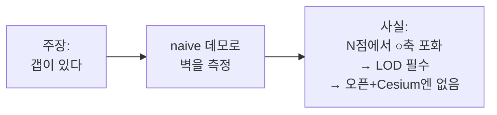

# 문제 정의와 범위 — 갭 실증 데모

> AI 시대에 코드는 싸졌다. 그래서 병목은 "어떻게 만드나"가 아니라 **"무엇을, 어디까지 푸나"** 로 이동한다.
> 이 문서는 첫 데모가 *무엇을 증명하는 물건인지* 못을 박는다. 이진 체크리스트는 [`../.claude-criteria.md`](https://github.com/thissak/CopcCesiumLab/blob/main/.claude-criteria.md).

## 문제 정의 (한 문장)

> **LOD 없이 naive하게 COPC를 Cesium에 직접 부었을 때 — ⓐ 정확히 그려지는가(T0), ⓑ 어디서·왜 무너지는가(4축 중 어느 축, 몇 점에서)를, 돌아가는 데모로 측정해 보인다.**

## 왜 이 데모인가

[STRATEGY.md](STRATEGY.md)에서 "갭이 있다 / 딸깍으론 안 된다"고 *주장*했다. 이 데모는 그 주장을 **증거**로 바꾼다:

## Falsifiable 주장 (이 데모가 내놓는 것)

| | 주장 | 판정 |
|--|------|------|
| **C1** | COPC → Cesium 직접 로드가 변환 없이 된다 (T0) | pass/fail |
| **C2** | naive 경로는 약 N점에서 ②/③/④ 중 한 축 포화로 무너진다 | 측정값 |
| **C3** | 나는 그 벽을 도구로 정확히 짚는다 (= "딸깍 아님" 실증 + 역량 검증) | yes/no |

## 범위

| ✅ IN (한다) | ❌ OUT (의도적으로 안 한다) |
|-------------|---------------------------|
| 공개 COPC 1~2개 (소형=정확성, 대형=벽 찾기) | LOD/SSE 스트리밍 엔진 → **Phase 2** |
| copc.js `Getter.http` → 점 → Cesium native 렌더 | A/B/C 아키텍처 결정 → 이 측정 **후** |
| georeferencing (wkt→ECEF) + T0 검증 | T1/T2 성능 목표 (**데모는 느려도 됨**) |
| 4축 계측, 점 수 올리며 벽 지점 기록 | 패키징·공개 API·문서 광택 |
| 산출물: 측정 1장 + 돌아가는 데모 | 다중 데이터셋·모바일·속성 필터 |

!!! warning "범위의 함정 두 개"
    - **너무 넓힘** — "이왕이면 LOD까지" → Phase 2를 끌어와 데모가 늪이 됨. **금지.**
    - **너무 좁힘** — "점만 뜨면 됨"(T0만) → 벽을 안 보니 갭 증명 실패. **벽까지 가야** 증거.

## 다음

승인됨(2026-06-16) → 데모 착수. 측정이 나오면 결과를 [STRATEGY.md](STRATEGY.md)·[REFERENCES.md](REFERENCES.md)에 증거로 반영하고, 그 데이터로 [05장](learn/05-copc-cesium-integration.md)의 A/C 아키텍처를 결정한다.

← [STRATEGY](STRATEGY.md) · [PROFILING](PROFILING.md) · [PROGRESS](PROGRESS.md)
