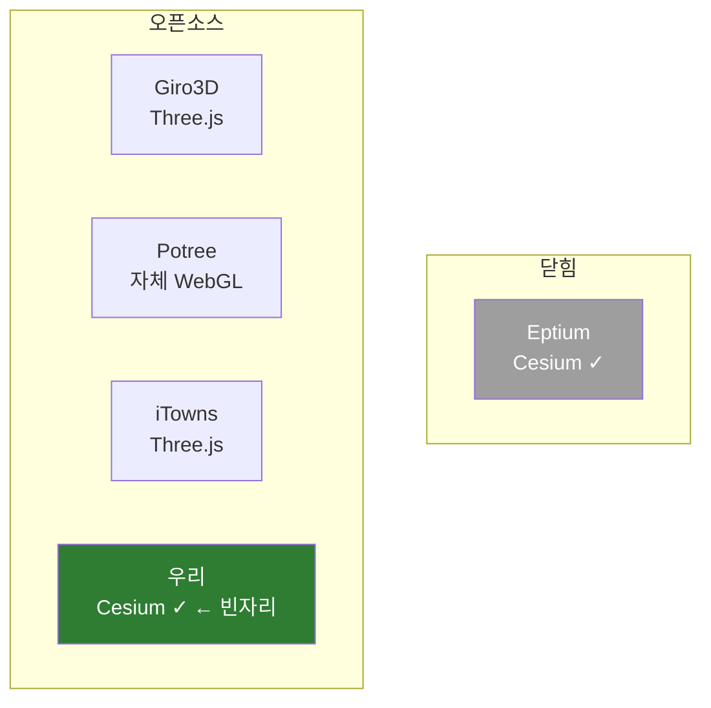

# 성능 목표와 경쟁 지형

> 우리의 "레퍼런스"는 무엇이고 무엇이 아닌가. 무엇을 따라잡아야 하고 무엇을 따라잡으면 안 되는가.
> 짝 문서: [REFERENCES.md](REFERENCES.md)(prior art 지도) · [PROFILING.md](PROFILING.md)(4축 측정)

## TL;DR

- **한계를 두지 않는다 — Eptium도 정당한 목표이자 잣대다.** "된다"의 증거인 동시에 성능 비교 대상. 측정(2026-06-20, point budget 후)으로 **매칭 작동점에서 GPU 비용 동급~우위**(ours ~0.4–0.57×)를 확인했다 — *"프로토타입이 상용을 정면 추격하는 건 비현실적"*이라던 과거 가정은 측정으로 반증됐다. 극한까지 최적화한다([[optimize-to-the-extreme]]).
- 오픈소스 동료(Giro3D·Potree·iTowns)도 비교 대상 — 렌더 엔진은 다르나(Three.js/자체 WebGL) 데이터 레이어는 형제고, 열려 있어 실측이 쉽다.
- **정직은 천장이 아니라 규율이다.** Eptium은 closed라 작동점·조건 한정 caveat가 따라붙고, 측정으로만 주장하며 over-headline은 피한다 — 단 이는 *야망의 한계가 아니라 정확성*이다. 더 빠르게·더 크게는 항상 추구한다.

## Eptium도 잣대다 — 측정이 추격을 가능케 했다

이전 판본은 *"프로토타입이 상용을 정면 추격하는 건 비현실적"*이라며 Eptium을 성능 잣대에서 뺐다. **그 가정은 측정으로 반증됐다**(2026-06-20): point budget 도입 후 매칭 작동점·정상상태에서 ours GPU 비용이 Eptium의 ~0.4–0.57×(동급~우위). 그러니 천장을 두지 않는다.

| Eptium을 이렇게 쓴다 ✅ |
|------------------------|
| **실현 가능성 증명** — "된다"를 보증 (아키텍처 청사진: 3D Tiles 래핑이 맞다) |
| **성능 목표이자 잣대** — 매칭 작동점서 동급/우위를 측정으로 입증, 더 밀어붙인다 |
| **차별화의 대조군** — 우리는 *오픈소스 + Cesium + 무변환* 빈자리에 더해 성능까지 건다 |

남는 제약은 *야망이 아니라 방법론*에 관한 것:

1. **closed라 측정 방법에 주의.** Eptium은 소스가 없고 plateau가 뷰포트 따라 변동(400~764k) → 작동점·조건을 통제하고 caveat를 명시해야 한다. *비교 불가가 아니라, 정직하게 통제해 비교한다* (`docs/bench/FINDINGS.md`의 매칭 head-to-head 방법론).
2. **대회가 보는 건 성능만이 아니다.** Gaia3D 과제는 오픈소스 라이브러리를 원한다 — 척도 = 정확성 + 재사용 API + **충분히 빠른(이왕이면 상용 동급/우위) 성능** + 문서 + 완성도. 성능은 *그중 하나이자, 깊이를 보이는 증거*다(감점 1순위 "AI 코드 원리 설명 못 함"의 반대).

## "오픈소스 동료"란 무엇인가

**같은 문제**(웹에서 COPC 포인트클라우드를 LOD 스트리밍으로 렌더)를 **이미 오픈소스로 푼 프로젝트들**. 단 렌더 엔진이 우리와 다르다.

| 프로젝트 | 오픈소스 | 렌더 엔진 | COPC 스트리밍 | CesiumJS |
|----------|:-------:|----------|:------------:|:--------:|
| **Eptium** | ❌ 상용 | Cesium | ✅ | ✅ |
| **Giro3D** | ✅ | Three.js | ✅ | ❌ |
| **iTowns** | ✅ | Three.js | ✅ | ❌ |
| **Potree** | ✅ | 자체 WebGL | ✅ | ❌ |
| **우리 (CopcCesiumLab)** | ✅ 목표 | **Cesium** | 목표 | **✅** |

핵심: **"오픈소스 ∩ CesiumJS" 칸이 비어 있다.** 이게 우리가 채우는 자리이자 입상 논리다.

## Giro3D는 같은 기능인가 — 반만 맞다

**같은 것 (그래서 배운다):**

- COPC 데이터 처리 — `copc.js`로 Range fetch, `laz-perf`로 디코드(워커), 옥트리 순회. **우리와 동일 라이브러리.**
- 포인트클라우드 LOD 렌더 — point budget, 거리 기반 LOD, 속성(intensity/classification/색) 필터.

**다른 것 (그래서 그대로 못 쓴다):**

- **렌더러가 Three.js.** 과제는 *"CesiumJS 기반"* 명시 → Giro3D를 가져다 쓰면 요건 위반.
- 지구본·영상·지형 생태계가 Cesium과 다름.

→ Giro3D는 **"Three.js판 COPC 뷰어"**. 데이터 레이어는 형제, **우리가 만들 Cesium 통합은 Giro3D에 없다.** 그래서 [Giro3D 소스 정독](REFERENCES.md)의 가치는 *"Cesium 코드 베끼기"*가 아니라 **"렌더러와 무관한 COPC 스트리밍 로직(fetch/decode/octree/budget) 흡수"**.

## 왜 오픈 동료가 성능 비교 대상인가

렌더러가 다른데도 비교 대상인 이유 둘:

1. **포인트클라우드 병목은 렌더러와 거의 무관.** [4축](PROFILING.md) 중 ①fetch ②decode ③CPU는 Cesium이든 Three.js든 동일하게 겪는다 (둘 다 WebGL로 수백만 점을 민다).
2. **들여다보고 직접 돌릴 수 있다.** 오픈이라 같은 데이터·같은 하드웨어로 실측 → 공정 비교. Eptium은 불가.

## 계단식 성능 레퍼런스

단일 목표 대신 계단으로. 수치는 Phase 1 측정 후 채운다.

| Tier | 기준 | 성격 |
|------|------|------|
| **T0 정확성** | 실제 COPC를 *변환 없이* 직접 로드 + georeferencing 정확 | 안 되면 나머지 무의미 |
| **T1 쓸만함** | 수백만 점을 일반 노트북에서 **인터랙티브(≥30fps)** + LOD 매끄럽고 메모리 유한 | **데모·심사가 실제로 보는 바** |
| **T2 경쟁력** | **오픈 동료(Giro3D/Potree) 동급 + Eptium 매칭 작동점 동급/우위**(측정 확인), 1억+ 점 스트리밍 안 죽음 | 공정한 비교선 — *달성* |
| **T3 스트레치** | Eptium급 스케일(수십억)·전 작동점 우위 | 보너스가 아니라 **적극 추구** — 한계를 두지 않는다 |

!!! quote "핵심 한 줄"
    **차별화는 "오픈소스 + Cesium + 변환 없는 단일 파일"이라는 빈자리에서 출발하되, 거기서 멈추지 않는다.** 빈자리는 입장권이고, 측정으로 입증한 **성능(매칭 작동점 Eptium 동급/우위)** 과 **깊이**가 그 위에 쌓는 우위다. 한계를 두지 않고 — 더 빠르게·더 크게·전 작동점 우위까지 — 극한으로 민다. 단 주장은 측정으로만, caveat와 함께.

---

← [REFERENCES](REFERENCES.md) · [PROFILING](PROFILING.md) · [학습 커리큘럼](learn/index.md) · [PROGRESS](PROGRESS.md)
