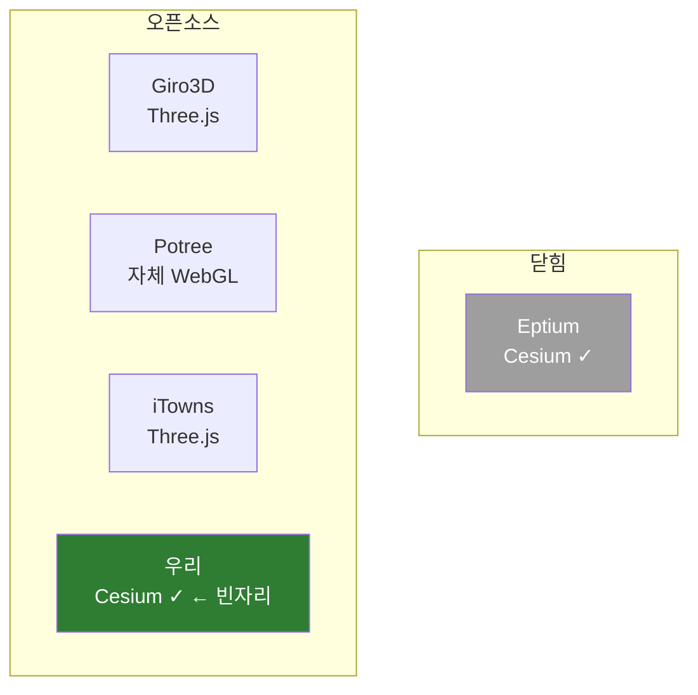

# 성능 목표와 경쟁 지형

> 우리의 "레퍼런스"는 무엇이고 무엇이 아닌가. 무엇을 따라잡아야 하고 무엇을 따라잡으면 안 되는가.
> 짝 문서: [REFERENCES.md](REFERENCES.md)(prior art 지도) · [PROFILING.md](PROFILING.md)(4축 측정)

## TL;DR

- **Eptium의 성능을 따라잡는 게 목표가 아니다.** Eptium은 *"된다"의 증거*이지 *"얼마나 빠른가"의 잣대*가 아니다.
- 공정하고 의미 있는 비교 대상은 **오픈소스 동료(Giro3D·Potree·iTowns)** 다.
- 단 그들은 **렌더 엔진이 다르다(Three.js/자체 WebGL)** — 데이터 레이어는 형제, Cesium 통합은 남남.
- 실제 수치 목표는 **Phase 1 baseline 측정 후** 박는다 (추측 금지).

## Eptium은 잣대가 아니다

| Eptium을 이렇게 쓴다 ✅ | 이렇게 쓰면 안 된다 ❌ |
|------------------------|----------------------|
| **실현 가능성 증명** — "된다"를 보증 | **성능 벤치마크** — "이 FPS를 쳐라" |
| **아키텍처 청사진** — 3D Tiles 래핑이 맞다 | **추격 대상** — 따라잡기 레이스 |

이유:

1. **상대가 안 맞는다.** Eptium은 COPC 창시자들이 수년간 다듬은 성숙한 **상용 제품**. 프로토타입/대회 출품작이 풀 성능을 정면 추격하는 건 비현실적이고, 근접해도 그게 입상 척도가 아니다.
2. **대회가 보는 건 그게 아니다.** Gaia3D 과제는 *오픈소스 라이브러리/플러그인*을 원한다. 척도 = **정확성 + 재사용 가능한 깨끗한 오픈 API + 충분한 성능 + 문서**.
3. **닫혀 있어 비교 불가.** Eptium은 소스도, 같은 데이터로 실측할 방법도 없다.

## "오픈소스 동료"란 무엇인가

**같은 문제**(웹에서 COPC 포인트클라우드를 LOD 스트리밍으로 렌더)를 **이미 오픈소스로 푼 프로젝트들**. 단 렌더 엔진이 우리와 다르다.

| 프로젝트 | 오픈소스 | 렌더 엔진 | COPC 스트리밍 | CesiumJS |
|----------|:-------:|----------|:------------:|:--------:|
| **Eptium** | ❌ 상용 | Cesium | ✅ | ✅ |
| **Giro3D** | ✅ | Three.js | ✅ | ❌ |
| **iTowns** | ✅ | Three.js | ✅ | ❌ |
| **Potree** | ✅ | 자체 WebGL | ✅ | ❌ |
| **우리 (CopcCesiumLab)** | ✅ 목표 | **Cesium** | 목표 | **✅** |

핵심: **"오픈소스 ∩ CesiumJS" 칸이 비어 있다.** 이게 우리가 채우는 자리이자 입상 논리다.

## Giro3D는 같은 기능인가 — 반만 맞다

**같은 것 (그래서 배운다):**

- COPC 데이터 처리 — `copc.js`로 Range fetch, `laz-perf`로 디코드(워커), 옥트리 순회. **우리와 동일 라이브러리.**
- 포인트클라우드 LOD 렌더 — point budget, 거리 기반 LOD, 속성(intensity/classification/색) 필터.

**다른 것 (그래서 그대로 못 쓴다):**

- **렌더러가 Three.js.** 과제는 *"CesiumJS 기반"* 명시 → Giro3D를 가져다 쓰면 요건 위반.
- 지구본·영상·지형 생태계가 Cesium과 다름.

→ Giro3D는 **"Three.js판 COPC 뷰어"**. 데이터 레이어는 형제, **우리가 만들 Cesium 통합은 Giro3D에 없다.** 그래서 [Giro3D 소스 정독](REFERENCES.md)의 가치는 *"Cesium 코드 베끼기"*가 아니라 **"렌더러와 무관한 COPC 스트리밍 로직(fetch/decode/octree/budget) 흡수"**.

## 왜 오픈 동료가 성능 비교 대상인가

렌더러가 다른데도 비교 대상인 이유 둘:

1. **포인트클라우드 병목은 렌더러와 거의 무관.** [4축](PROFILING.md) 중 ①fetch ②decode ③CPU는 Cesium이든 Three.js든 동일하게 겪는다 (둘 다 WebGL로 수백만 점을 민다).
2. **들여다보고 직접 돌릴 수 있다.** 오픈이라 같은 데이터·같은 하드웨어로 실측 → 공정 비교. Eptium은 불가.

## 계단식 성능 레퍼런스

단일 목표 대신 계단으로. 수치는 Phase 1 측정 후 채운다.

| Tier | 기준 | 성격 |
|------|------|------|
| **T0 정확성** | 실제 COPC를 *변환 없이* 직접 로드 + georeferencing 정확 | 안 되면 나머지 무의미 |
| **T1 쓸만함** | 수백만 점을 일반 노트북에서 **인터랙티브(≥30fps)** + LOD 매끄럽고 메모리 유한 | **데모·심사가 실제로 보는 바** |
| **T2 경쟁력** | **오픈 동료(Giro3D/Potree)와 동급** 성능, 1억+ 점을 스트리밍으로 안 죽고 처리 | 공정한 비교선 |
| **T3 스트레치** | Eptium급 스케일(수십억) 근접 | 입상 필수 아님. 보너스 |

!!! quote "핵심 한 줄"
    **Eptium은 "되는가"의 증거이지 "얼마나 빠른가"의 잣대가 아니다.** 우리 잣대는 *"쓸만하게 부드럽고(T1) + 오픈 동료와 동급(T2) + 코드가 깨끗하고 재사용 가능"*. 차별화는 속도가 아니라 **"오픈소스 + Cesium + 변환 없는 단일 파일"** 이라는 빈자리 그 자체다.

---

← [REFERENCES](REFERENCES.md) · [PROFILING](PROFILING.md) · [학습 커리큘럼](learn/index.md) · [PROGRESS](PROGRESS.md)
