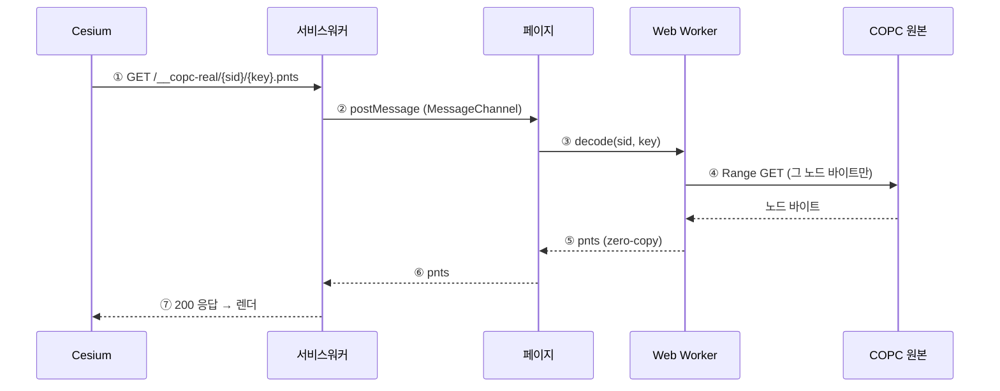

# 00. 큰 그림 — 한 요청의 일생

> 한 줄: **Cesium이 타일 하나를 달라고 하면, 서비스워커가 그 요청을 가로채 페이지로 넘기고,
> Web Worker가 그 노드만 디코드해 돌려준다.** 사전 변환은 0.

## 왜 이런 구조인가

핵심 발상 하나로 전체가 풀립니다 — **Cesium은 COPC를 모른다.**

Cesium은 자기가 평범한 [3D Tiles](https://github.com/CesiumGS/3d-tiles) 서버를 보고 있다고 믿고,
필요한 타일을 그냥 URL로 요청합니다. 우리는 그 요청을 **가로채서**, 바로 그 순간 COPC 파일의
해당 노드만 디코드해 응답합니다. 그래서 미리 변환해 둔 파일이 필요 없습니다.

## 등장인물

| 배우 | 코드 | 역할 |
|------|------|------|
| **Cesium** | (라이브러리) | 어느 노드가 필요한지(LOD) 판정하고 타일을 URL로 요청 |
| **서비스워커** | `public/copc-sw.js` | 네트워크 계층에서 그 요청을 가로챔 |
| **페이지** | `src/copc-tileset.ts` | 요청을 받아 *라우팅* (점 데이터냐 / 서브페이지냐) |
| **Web Worker** | `src/decode.worker.ts` | laz-perf로 디코드 — 무거운 일을 메인스레드 밖에서 |
| **COPC 원본** | 클라우드의 `.copc.laz` | 점 데이터. 한 번에 다 받지 않고 **조각으로** 읽음 |

## 한 요청의 일생



아래에서 화살표를 하나씩 따라갑니다.

### ① Cesium → 서비스워커 : 타일 요청

Cesium이 요청하는 URL은 우리가 만들어 준 것입니다. tileset을 만들 때 각 노드의 content 주소를
`/__copc-real/{sid}/{key}.pnts` 로 적어 둡니다.

```ts
// src/tileset.ts — buildNode()
content: { uri: contentBase + key + '.pnts' },  // contentBase = .../__copc-real/{sid}/
```

- `key` 는 옥트리 노드 좌표 `'깊이-X-Y-Z'` (예: `3-2-1-0`).
- `sid` 는 세션 ID (`s1`, `s2`…) — 한 페이지에 여러 tileset이 떠도 안 섞이게 하는 꼬리표.

### ② 서비스워커가 가로챈다

**서비스워커**는 페이지와 네트워크 사이에 한 번 등록해 두면, 이후 페이지가 보내는 요청을 중간에서
가로챌 수 있는 프록시입니다. `/__copc-real/` 로 시작하는 요청만 낚아챕니다.

```js
// public/copc-sw.js — fetch 리스너
if (url.pathname.startsWith('/__copc-real/')) {
  // 페이지(client)에게 "이 타일 좀 만들어 줘" 라고 넘긴다
  client.postMessage({ type: 'copc-tile', key, path: rest }, [ch.port2]);
}
```

서비스워커와 페이지는 서로 다른 실행 맥락이라 함수를 직접 부를 수 없습니다. 그래서 **MessageChannel**
(`ch.port2`)이라는 일회용 응답 채널을 같이 넘겨, 페이지가 결과를 이 채널로 돌려보내게 합니다.

> 왜 하필 서비스워커인가(대안과 트레이드오프)는 → [02. 서비스워커](02-service-worker.md) · [ADR-002](../adr/002-service-worker-tile-interception.md)

### ③ 페이지가 받아 라우팅한다

페이지의 핸들러는 경로를 보고 두 갈래로 나눕니다 — **점 데이터(.pnts)** 냐, **서브페이지(page/….json)** 냐.

```ts
// src/copc-tileset.ts — installHandler()
if (rest.startsWith('page/')) {
  port?.postMessage({ json: await buildPageTileset(sid, key) }); // 깊은 계층 lazy 확장 → 05장
} else {
  const pnts = await decodeTile(sid, key);   // 이 노드를 워커에 디코드 위임
  port?.postMessage(pnts, [pnts]);           // ⑤ 결과를 zero-copy 로 돌려줌
}
```

지금은 `.pnts` 갈래를 따라갑니다. `page/` 갈래(대용량 옥트리를 본 만큼만 펼치기)는
→ [05. hierarchy 페이징](05-hierarchy-paging.md).

### ④ 워커가 그 노드만 읽어 디코드한다

워커는 COPC 파일 **전체**가 아니라 그 노드에 해당하는 **바이트 구간만** 가져옵니다. HTTP의
`Range` 헤더로 "파일의 N번째부터 M번째 바이트만" 달라고 요청하는 방식입니다 — 이게 "변환 없이
스트리밍"의 심장입니다.

```ts
// src/copc-core.ts — httpGetterWithRetry()
const res = await fetchImpl(url, {
  headers: { Range: `bytes=${begin}-${end - 1}` },  // 그 노드 바이트만
  signal: AbortSignal.timeout(timeoutMs),
});
```

받아온 바이트를 laz-perf(WASM)로 압축 해제하고 좌표를 지구 좌표로 바꿉니다 → [03. 워커 디코드](03-worker-decode.md).

> 화면을 깊게 채울 땐 이 per-node `Range GET`이 수십 번이 됩니다. 그 **요청 개수**를 줄이는 게
> deep-load 속도의 레버입니다 → [07. range coalescing](07-range-coalescing.md).

### ⑤ pnts 를 zero-copy 로 돌려준다

디코드 결과는 `.pnts`(3D Tiles 포인트클라우드 포맷) 바이너리입니다. 점이 많으면 이 버퍼가 크기 때문에,
**복사하지 않고 소유권만 넘기는** transferable 방식으로 전달합니다(`postMessage(pnts, [pnts])`).
버퍼를 한 번 더 복사하는 비용을 없앱니다.

### ⑥⑦ 서비스워커가 응답으로 포장한다

페이지가 돌려준 바이너리를 서비스워커가 평범한 HTTP 200 응답으로 감싸면, Cesium은 그게 COPC에서
즉석 디코드된 것인 줄도 모른 채 렌더합니다.

```js
// public/copc-sw.js
return new Response(data, { status: 200, headers: { 'Content-Type': 'application/octet-stream' } });
```

만약 페이지가 영영 응답하지 않으면? 서비스워커에 **40초 백스톱 타임아웃**이 걸려 있어 무한 대기 대신
500으로 실패시킵니다 — 이 랩의 규칙: [조용한 실패·무한 대기 금지](../learn/06-streaming-engine-and-production-core.md).

## 세 가지만 기억하면 됩니다

1. **Cesium은 COPC를 모른다** → 그래서 통합이 깔끔하다. (→ [01](01-public-api-and-isomorphism.md))
2. **가로채기 = 서비스워커, 디코드 = Web Worker** → 역할이 갈려 있다. (→ [02](02-service-worker.md)·[03](03-worker-decode.md))
3. **"언제 어느 노드"는 Cesium이 정한다** (LOD 위임). 우리는 "그 노드"를 공급만 한다. (→ [04](04-lod-delegation.md))

## 이 그림에서 아직 안 푼 것

- `sid` 와 세션 생명주기(여러 tileset·정리) → [06. 상용 코어](06-production-core.md)
- `page/{key}.json` 갈래(서브페이지) → [05. hierarchy 페이징](05-hierarchy-paging.md)
- 옥트리 노드가 어떻게 3D Tiles 타일이 되나(`key`·geometricError) → [01. 공개 API와 동형성](01-public-api-and-isomorphism.md)
- ④의 노드별 `Range GET`이 깊은 로드에서 수십 번이 되는 문제(요청 묶기) → [07. range coalescing](07-range-coalescing.md)

---

다음 → [01. 공개 API와 동형성](01-public-api-and-isomorphism.md) · 처음 → [아키텍처 트랙](index.md)
