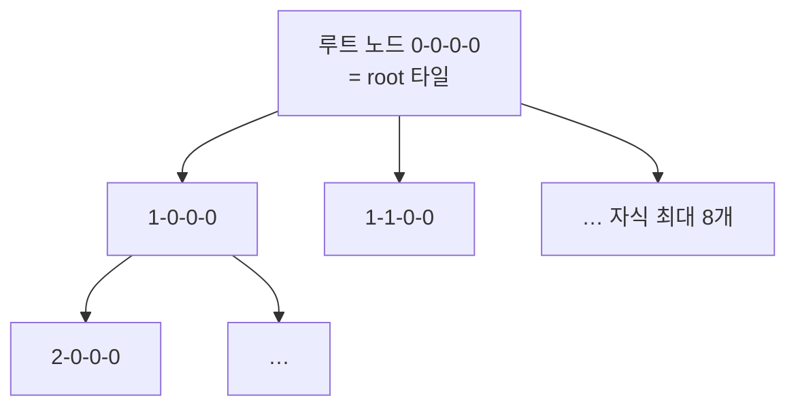

# 01. 공개 API와 동형성

> 한 줄: **COPC URL 하나로 `Cesium3DTileset`이 나오는 이유는, COPC 옥트리와 3D Tiles가 사실상 같은 구조(동형)이기 때문이다.**

[00장](00-big-picture.md)에서 Cesium이 타일을 요청하는 장면(①)을 봤습니다. 이 장은 그 *직전* —
요청이 일어나려면 먼저 **옥트리를 Cesium이 이해하는 tileset으로 번역**해 둬야 합니다. 그 번역이 이 프로젝트의
핵심 아이디어입니다.

## 한 줄짜리 표면

라이브러리가 밖으로 내보내는 건 딱 하나입니다.

```ts
// src/index.ts
export { CopcTileset } from './copc-tileset';
```

```ts
const tileset = await CopcTileset.fromUrl(url);   // ← 이 한 줄이 전부
viewer.scene.primitives.add(tileset);
```

`fromUrl()` 안에서 일어나는 일을 한 줄로 줄이면: **COPC를 열어 → 옥트리를 tileset.json으로 만들어 →
그걸 Cesium에 건넨다.** tileset.json을 파일로 저장하지 않고 `data:` URL(문자열에 박은 가짜 파일)로
바로 먹이는 게 트릭입니다.

```ts
// src/copc-tileset.ts — fromUrl()
const tilesetJson = buildTileset(session, contentBase);
const tileset = await Cesium3DTileset.fromUrl(
  'data:application/json;base64,' + btoa(JSON.stringify(tilesetJson)),  // 디스크 안 거침
);
```

## 왜 번역이 깔끔한가 — 두 구조가 닮았다

COPC는 점을 **옥트리**(공간을 8등분씩 재귀로 나눈 트리)로 담습니다. 3D Tiles도 공간을 타일 트리로
담습니다. 둘을 나란히 놓으면 거의 1:1로 포개집니다.

| COPC 옥트리 | ↔ | 3D Tiles |
|------------|---|----------|
| 옥트리 노드 | ↔ | 타일 |
| 노드의 공간 범위(큐브) | ↔ | `boundingVolume` |
| 노드 점 데이터 | ↔ | 타일 `content`(.pnts) |
| 자식 노드 8개 | ↔ | `children[]` |
| `spacing / 2^깊이` | ↔ | `geometricError` |

이 닮음 덕분에, COPC 노드 하나를 3D Tiles 타일 하나로 그대로 옮겨 적기만 하면 됩니다.



노드 좌표는 `'깊이-X-Y-Z'` 문자열 키(`key`)입니다. 자식 8개는 비트 연산으로 만듭니다.

```ts
// src/tileset.ts — childKeys()
const ck = `${d + 1}-${x * 2 + (i & 1)}-${y * 2 + ((i >> 1) & 1)}-${z * 2 + ((i >> 2) & 1)}`;
```

## 결정적 한 줄 — `geometricError = spacing / 2^깊이`

표에서 마지막 줄이 이 시스템의 열쇠입니다. **geometricError**는 "이 타일까지만 그리면 화면에 이만큼
오차가 남는다"를 Cesium에게 알려주는 숫자입니다.

```ts
// src/tileset.ts — nodeRegionAndError()
const spacingM = s.spacing * s.zUnit;          // 점 간격(미터)
return { region: [...], geomError: spacingM / 2 ** d };   // 깊이 d 1↑ → 오차 1/2
```

옥트리는 깊이가 1 내려갈 때마다 점 간격이 절반으로 촘촘해집니다. 그래서 기하 오차도 깊이마다 절반.
Cesium은 이 값만 보고 **"지금 화면에서 이 타일로 충분한가, 더 내려가야 하나"**를 스스로 정합니다 —
그게 LOD이고, 우리가 손대지 않습니다. 어떻게 정하는지는 → [04. LOD 위임](04-lod-delegation.md).

## 왜 이 아키텍처(A안)인가

COPC를 Cesium에 붙이는 길은 셋이었습니다(자세히 → [05장 학습](../learn/05-copc-cesium-integration.md)):

- **A. on-the-fly 3D Tiles** — 옥트리를 가짜 tileset으로 노출, LOD는 Cesium이. ← **채택**
- B. custom WebGL primitive — 점도 LOD도 직접. Cesium이 이미 가진 걸 재발명.
- C. Potree-in-Cesium — Potree가 점을, Cesium은 지구본만. "Cesium 네이티브"로 보기 애매.

A안은 위 동형성을 그대로 이용해 **Cesium의 컬링·LOD·메모리 관리를 공짜로** 얻습니다. 근거와 트레이드오프는
→ [ADR-001](../adr/001-provider-plugin-architecture-A.md).

---

← 이전: [00. 큰 그림](00-big-picture.md) · 다음 → [02. 서비스워커 — 요청 가로채기](02-service-worker.md)
