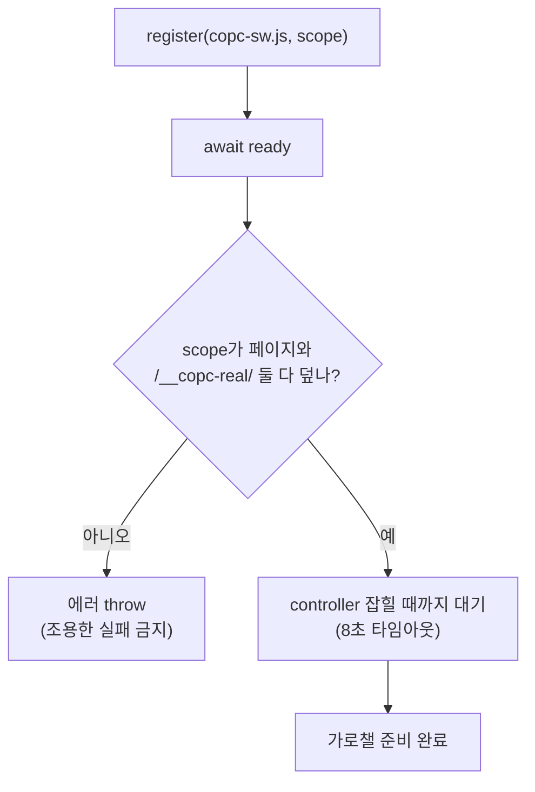

# 02. 서비스워커 — 요청 가로채기

> 한 줄: **Cesium은 COPC를 모른 채 타일을 URL로 요청하고, 서비스워커가 그 요청을 네트워크 계층에서 가로채
> 페이지로 넘긴다.** 이게 "사전 변환 없이"를 가능하게 하는 길목이다.

[00장](00-big-picture.md)의 ②번 화살표를 자세히 봅니다.

## 무슨 문제를 푸나

[01장](01-public-api-and-isomorphism.md)에서 옥트리를 tileset으로 번역했습니다. 그런데 tileset의 각 타일은
`/__copc-real/{sid}/{key}.pnts` 라는 **존재하지 않는 URL**을 가리킵니다. 그런 파일은 서버에 없습니다 —
우리는 그 노드를 *요청이 올 때* 즉석에서 만들 생각이니까요.

그래서 필요한 게 "그 URL로 요청이 나가면 가로채서 내가 응답한다"는 장치입니다. 브라우저에서 그걸 해 주는 게
**서비스워커**입니다.

## 서비스워커란

페이지와 네트워크 사이에 한 번 등록해 두는 작은 프로그램입니다. 등록되면 그 범위(scope) 안의 페이지가
보내는 모든 요청(`fetch`/XHR)을 중간에서 가로채, 진짜 네트워크로 보낼지 / 내가 직접 응답할지 정할 수 있습니다.

```js
// public/copc-sw.js — 핵심은 fetch 이벤트 하나
self.addEventListener('fetch', (e) => {
  const url = new URL(e.request.url);
  if (url.pathname.startsWith('/__copc-real/')) {
    e.respondWith(/* 페이지에 물어봐서 만든 응답 */);   // ← 가로채기
  }
});
```

`e.respondWith(...)` 가 핵심입니다. 이걸 부르면 Cesium은 평범한 서버 응답을 받은 줄 알지만, 사실은 우리가
즉석에서 만든 pnts입니다.

## 가로채서 어디로? — 페이지에게 위임

서비스워커는 무거운 일(COPC 디코드)을 직접 하지 않습니다. 디코드 도구(laz-perf·copc.js)는 페이지 쪽에
있으니까요. 그래서 **MessageChannel**이라는 일회용 통로를 만들어 페이지에 "이 타일 좀 만들어 줘"라고
넘기고, 그 통로로 결과를 돌려받습니다.

```js
// public/copc-sw.js — fetch 핸들러 안
const ch = new MessageChannel();
ch.port1.onmessage = (ev) =>
  ev.data && ev.data.error ? reject(new Error(ev.data.error)) : resolve(ev.data);
client.postMessage({ type: 'copc-tile', key: rest.split('/').pop(), path: rest }, [ch.port2]);
```

페이지가 이 메시지를 받아 디코드하는 쪽은 [00장의 ③④⑤ 단계](00-big-picture.md)와
[03. 워커 디코드](03-worker-decode.md)에서 다룹니다.

## 등록과 scope — 가장 자주 깨지는 곳

서비스워커는 **scope**(자기가 가로챌 경로 범위)를 가집니다. scope가 현재 페이지와 `/__copc-real/` 경로를
둘 다 덮지 못하면 가로채기가 조용히 안 됩니다. 그래서 `fromUrl()`은 등록 후 이 조건을 **명시적으로 검사**해
안 맞으면 에러를 표면화합니다.



```ts
// src/copc-tileset.ts — ensureServiceWorker()
if (!pageUrl.startsWith(reg.scope)) {
  throw new Error(`Service Worker scope가 현재 페이지를 덮지 않습니다. …`);
}
```

마지막 관문은 **controller**입니다. 서비스워커가 등록돼도 *이 페이지를 실제로 제어*하기까지 한 박자가
필요합니다. 그 전에 타일을 요청하면 가로채기가 빕니다. 그래서 `controllerchange`를 8초까지 기다리되,
안 오면 무한 대기 대신 타임아웃으로 실패시킵니다.

```ts
// src/copc-tileset.ts — waitForController()
const timeout = window.setTimeout(() => reject(new Error('controllerchange timeout')), timeoutMs);
navigator.serviceWorker.addEventListener('controllerchange', () => { clearTimeout(timeout); resolve(); }, { once: true });
```

## 왜 서비스워커인가

`fetch`를 직접 가로채는 다른 방법(예: Cesium의 `Resource` 훅)도 있지만, 서비스워커는 **Cesium이 무엇을
하든 네트워크 계층에서** 잡습니다 — Cesium 내부에 손대지 않아 [01장의 "Cesium은 COPC를 모른다"](01-public-api-and-isomorphism.md)를
그대로 지킵니다. 대신 scope·controller·소비자 배포(copc-sw.js를 자기 origin에 서빙)라는 비용이 붙습니다.
이 선택의 근거와 대안 비교는 → [ADR-002](../adr/002-service-worker-tile-interception.md).

---

← 이전: [01. 공개 API와 동형성](01-public-api-and-isomorphism.md) · 다음 → [03. 워커 디코드 — 메인스레드 밖](03-worker-decode.md)
