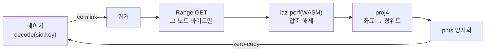

# 03. 워커 디코드 — 메인스레드 밖

> 한 줄: **압축 해제·좌표 변환·pnts 만들기 같은 무거운 일은 Web Worker에서 돈다.** 메인스레드(화면 그리는 곳)를
> 비워 둬야 끊김 없이 부드럽기 때문이다.

[00장](00-big-picture.md)의 ③④⑤ — 페이지가 워커에 디코드를 위임하고 pnts를 돌려받는 구간입니다.

## 무슨 문제를 푸나

COPC 노드 하나를 점으로 바꾸려면: ① 압축된 바이트를 받아 ② laz-perf(WASM)로 압축 해제하고 ③ 수십만 점의
좌표를 지구 좌표로 변환하고 ④ pnts 바이너리로 포장합니다. 이걸 **메인스레드에서 하면** 그 사이 화면이 멈춥니다
(점이 많을수록 길게). 그래서 메인스레드 밖, **Web Worker**라는 별도 실행 줄기로 보냅니다.

## 페이지 → 워커, 함수처럼 부르기 (comlink)

워커와는 원래 `postMessage`로 메시지를 주고받아야 해서 코드가 번거롭습니다. **comlink**는 그걸 감싸서
워커의 함수를 **마치 그 자리에 있는 함수처럼** 부르게 해 줍니다(`await`만 붙이면 됨).

```ts
// src/copc-tileset.ts — 워커를 한 번 만들고 comlink 로 감싼다
worker = new Worker(new URL('./decode.worker.ts', import.meta.url), { type: 'module' });
workerApi = Comlink.wrap<DecodeApi>(worker);
// 이후엔 그냥:  await workerApi.decode(sid, key)
```

워커 쪽은 그 함수들을 `expose`로 내놓기만 하면 됩니다.

```ts
// src/decode.worker.ts
const api = {
  async open(sid, url, opts) { /* COPC 세션 보관 */ },
  async decode(sid, key) { /* 노드 → pnts */ },
  async loadPage(sid, key) { /* 서브페이지 병합 → 05장 */ },
  async close(sid) { /* 정리 */ },
};
Comlink.expose(api);
```

## 워커 안에서 일어나는 일



압축 해제부터 좌표 변환까지는 `decodeNode()` 한 함수에 모여 있습니다. 점 하나하나를 돌며 좌표를 읽고 변환합니다.

```ts
// src/copc-core.ts — decodeNode()
const view = await Copc.loadPointDataView(s.getter, s.copc, node, { lazPerf });  // ② 압축 해제
for (let i = 0; i < n; i++) {
  const x = gx(i), y = gy(i), z = gz(i) * s.zUnit;
  const o = s.toWgs ? s.toWgs.forward([x, y]) : [x, y];   // ③ 투영좌표 → 경위도
  lonLatH.push(o[0], o[1], z);
}
```

## laz-perf는 WASM — 워커에서 한 번 더 챙길 것

laz-perf는 WebAssembly(브라우저용 .wasm)로 도는 디코더입니다. 워커 번들에서 **web 빌드 + wasm 파일 주소**를
직접 잡아 줘야 합니다. 그리고 Cesium은 워커에 들이지 않습니다(워커 번들을 가볍게).

```ts
// src/decode.worker.ts
import lazPerfWasmUrl from 'laz-perf/lib/web/laz-perf.wasm?url';
lazPerfPromise = LazPerf.create({ locateFile: () => lazPerfWasmUrl });   // wasm 주소 주입
```

## pnts로 포장하고 zero-copy로 돌려주기

좌표를 [3D Tiles pnts](https://github.com/CesiumGS/3d-tiles/tree/main/specification/TileFormats/PointCloud)
바이너리로 만듭니다. 위치를 `uint16`으로 **양자화**해 float 대비 절반 크기로 줄이고, 행성 스케일에서 생기는
미세 떨림(jitter)은 `RTC_CENTER`로 잡습니다(상세는 `src/pnts-quantized.ts`).

점이 많으면 이 버퍼가 큽니다. 그래서 워커→페이지로 돌려줄 때 **복사하지 않고 소유권만 넘기는**
transferable 방식을 씁니다.

```ts
// src/decode.worker.ts — decode()
const pnts = buildQuantizedPnts(nd.lonLatH, nd.colors!);
return Comlink.transfer(pnts, [pnts]);   // 복사 0 — 버퍼를 그대로 넘김
```

> "디코드는 SW도, 메인스레드도 아닌 Web Worker에서 돈다"는 이 분리는 위키에 더 깊게 정리돼 있습니다 →
> [decode-in-worker](../wiki/decode-in-worker.md).

위 그림의 `Range GET`은 노드마다 한 번이지만, 깊은 로드에선 인접 노드를 **한 번에** 묶어 왕복 수를
줄입니다(디코드 경로는 그대로) → [07. range coalescing](07-range-coalescing.md).

색을 어떻게 칠하는지(`colorBy`)는 [06장의 속성 기둥](06-production-core.md#4-속성)에서 다룹니다.

---

← 이전: [02. 서비스워커](02-service-worker.md) · 다음 → [04. LOD 위임 — Cesium에게 맡긴다](04-lod-delegation.md)
