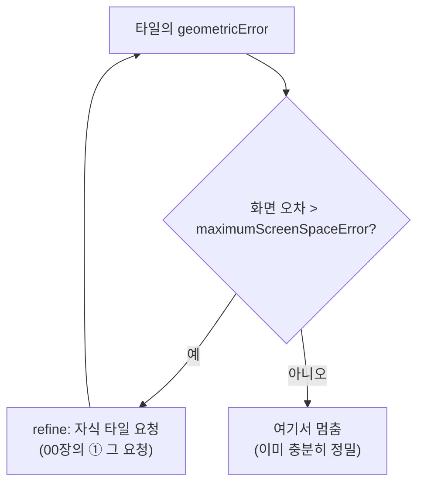

# 04. LOD 위임 — Cesium에게 맡긴다

> 한 줄: **"언제 어느 노드를 더 가져올지"(LOD)를 우리가 손코딩하지 않는다.** [01장에서 심은
> `geometricError`](01-public-api-and-isomorphism.md) 하나로 Cesium이 알아서 정한다.

[00장](00-big-picture.md)에서 "Cesium이 타일을 요청한다"고 했습니다. 그 **요청을 누가, 어떤 기준으로
일으키나**가 이 장의 주제입니다.

## 무슨 문제를 푸나

수억 점을 한 번에 다 그릴 순 없습니다. 카메라에서 가까운 곳은 촘촘히, 먼 곳은 듬성듬성 — 그게 **LOD**(Level
of Detail)입니다. 보통은 이걸 직접 짭니다: 프러스텀 컬링, 화면 오차 계산, point budget, 캐시… 전부 손코딩 대상이죠.

A안의 선택은 **그걸 안 짠다**는 것입니다. Cesium의 3D Tiles 엔진이 이미 그 일을 합니다. 우리는 옥트리를
3D Tiles로 번역만 해 두면, LOD 판정은 Cesium이 가져갑니다.

## Cesium의 판정 규칙 — SSE

Cesium은 타일마다 **화면 공간 오차(SSE, Screen-Space Error)**를 계산합니다 — 그 타일의 `geometricError`가
지금 카메라에서 화면에 몇 픽셀 오차로 보이는지입니다. 그 값이 임계치(`maximumScreenSpaceError`)보다 크면
"부족하다"고 보고 **자식 타일을 요청**(refine)합니다.



이 루프가 곧 [00장의 ①번 타일 요청](00-big-picture.md)을 *일으키는* 주체입니다.
즉 우리 서비스워커가 응답하는 요청은, 이 SSE 판정의 결과로 Cesium이 자발적으로 보낸 것입니다.

## 우리가 푼 건 단 두 줄

LOD 로직 대신 우리가 한 일은: ① 01장에서 `geometricError = rootSpanM / 16 / 2^깊이`를 심은 것, ② 그리고 노브 하나를
넘긴 것뿐입니다.

```ts
// src/copc-tileset.ts — fromUrl()
--8<-- "src/copc-tileset.ts:maxSSE"
```

`geometricError`가 정확해야 SSE 판정도 정확합니다. projected 데이터는 루트 hierarchy에서 LAS header Z
신뢰를 한 번 판정해, 세션 전체를 **header 교집합** 또는 **node cube** 중 하나로 고정합니다. 그래야 부모
bounding volume이 자식을 포함합니다. geographic 데이터는 mixed-unit cube 대신 유효 header Z를 사용합니다.

```ts
// src/tileset.ts — nodeRegionAndError() : 세로를 데이터 범위로 조임
--8<-- "src/tileset.ts:tileHeight"
```

## refine: ADD — 덮지 않고 더한다

각 타일은 `refine: 'ADD'`로 내보냅니다. 자식을 그릴 때 부모 점을 **지우지 않고 그 위에 더** 그린다는 뜻입니다.
포인트클라우드에서는 부모의 성긴 점 + 자식의 촘촘한 점이 합쳐져 자연스럽게 밀도가 올라갑니다.

```ts
// src/tileset.ts — buildNode()
--8<-- "src/tileset.ts:buildNode"
```

## 거친 LOD 단차를 부드럽게

LOD가 단계로 바뀌면 점 크기·밀도가 *툭툭* 끊겨 보일 수 있습니다. 이건 Cesium이 가진 포인트클라우드 셰이딩으로 가립니다 —
거리 기반 점 크기 감쇠(attenuation)와 깊이 윤곽 강조(Eye Dome Lighting). 역시 직접 셰이더를 짜지 않고
**옵션만** 켭니다.

```ts
// src/copc-tileset.ts — fromUrl()
tileset.pointCloudShading.attenuation = true;
tileset.pointCloudShading.eyeDomeLighting = edl;
```

## 왜 위임인가

메모리 상한·동시 요청 수·캐시 축출 같은 것도 Cesium이 이미 관리합니다. 직접 만들면 그걸 재발명하는
셈입니다. "측정 후 필요하면 그때" 원칙으로, 우선 Cesium에 맡기고 [PROFILING 4축](../PROFILING.md)으로
한계를 잰 뒤에만 손댑니다. 이 위임 결정은 → [ADR-001](../adr/001-provider-plugin-architecture-A.md) ·
[ADR-004(메모리·동시성 위임)](../adr/004-delegate-memory-concurrency-to-cesium.md).

---

← 이전: [03. 워커 디코드](03-worker-decode.md) · 다음 → [05. hierarchy 페이징 — 본 만큼만 깊이](05-hierarchy-paging.md)
