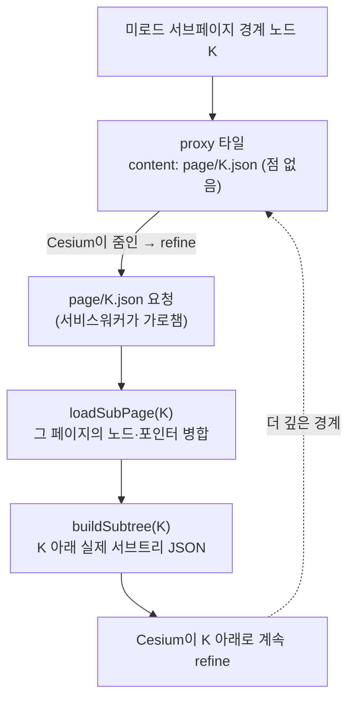

# 05. hierarchy 페이징 — 본 만큼만 깊이

> 한 줄: **대용량 옥트리의 깊은 계층은 미리 다 펼치지 않고, 카메라가 들어간 만큼만 그 자리에서 lazy로 펼친다.**
> [00장](00-big-picture.md)의 `page/{key}.json` 갈래가 바로 이것이다.

## 깊이의 벽 — 작은 데이터에선 안 보이던 결함

[04장](04-lod-delegation.md)까지면 LOD가 도는 것 같습니다. 그런데 COPC의 옥트리 계층(hierarchy) 자체가
**여러 페이지로 쪼개져** 저장돼 있다는 사실이 함정을 만듭니다.

- **소형 샘플**: 옥트리 전체가 우연히 루트 페이지 하나에 다 들어감 → 멀쩡히 떠서 "된다"고 착각.
- **국가 규모 대용량**: 깊은 계층이 별도 **서브페이지**로 분리돼 있음 → 줌인하면 디테일이 **에러도 없이
  조용히 끊김**.

성능 이전에 **정확성**의 벽이었습니다. 처음에 루트 페이지의 노드만 tileset에 넣으면, 서브페이지에 있는 깊은
노드들은 Cesium이 존재 자체를 모릅니다.

## 해법 — 페이지 경계에 proxy 타일을 둔다

LOD 위임 철학을 그대로 따릅니다. 미로드 서브페이지의 경계 노드 `K`를, 점 데이터 대신 **외부 tileset을
가리키는 proxy 타일**로 내보냅니다. Cesium이 거기까지 줌인(refine)하면 그제서야 그 JSON을 요청하고, 우리는
그때 서브페이지를 읽어 진짜 서브트리를 만들어 줍니다.



proxy 타일은 점(`.pnts`)이 아니라 child tileset JSON을 content로 가집니다.

```ts
// src/tileset.ts — pageProxy()
return {
  boundingVolume: { region }, geometricError: geomError, refine: 'ADD',
  content: { uri: contentBase + 'page/' + key + '.json' },   // 점이 아니라 child tileset
};
```

자식을 만들 때, 그 자식이 미로드 서브페이지면 proxy로, 아니면 평범한 노드로 분기합니다.

```ts
// src/tileset.ts — buildNode()
const children = childKeys(s, key).map((ck) =>
  s.pages[ck] ? pageProxy(s, ck, contentBase) : buildNode(s, ck, contentBase),
);
```

## 요청이 오면 — 서브페이지를 그 자리에서 로드

`page/K.json` 요청은 [02장 서비스워커](02-service-worker.md)가 가로채 페이지로 넘기고, 페이지는 **지오메트리
세션과 워커 세션 둘 다에** 서브페이지를 로드한 뒤(둘이 같은 노드를 알아야 함) 서브트리 JSON을 돌려줍니다.

```ts
// src/copc-tileset.ts — buildPageTileset()
const [loaded] = await Promise.all([loadSubPage(session, key), getWorkerApi().loadPage(sid, key)]);
if (!loaded && !session.nodes[key]) throw new Error(`page ${key}: 로드 후에도 노드 없음 (잘못된 키)`);
return JSON.stringify(buildSubtree(session, key, contentBase));
```

서브페이지 로드는 루트 페이지를 읽던 **같은 함수로** 자식 페이지를 읽어 세션에 병합하는 일입니다.

```ts
// src/copc-core.ts — loadSubPage()
const sub = await Copc.loadHierarchyPage(s.getter, ptr);
Object.assign(s.nodes, sub.nodes);   // K와 그 하위 실노드
Object.assign(s.pages, sub.pages);   // 더 깊은 미로드 페이지 포인터
delete s.pages[key];                  // 로드 완료 → 더는 미로드 아님
```

이렇게 깊이는 **본 만큼만** 펼쳐집니다. 한 번도 줌인하지 않은 영역의 깊은 계층은 영영 네트워크를 타지 않습니다.

## 측정으로 확인한 갭

추측이 아니라 숫자로 확인했습니다: 소형 샘플은 서브페이지 0개(전부 보임), 대용량은 100여 개 서브페이지가
통째로 안 보이고 있었습니다. 이게 "돌기만 함 vs 상용 코어"의 정체였습니다.

> 더 깊은 메커니즘(프록시 경계·연속 geometricError 등)은 위키에 →
> [hierarchy-subpage-paging](../wiki/hierarchy-subpage-paging.md) · 결정은 → [ADR-003](../adr/003-hierarchy-subpage-paging.md).

## 알려진 한계

방문한 노드는 세션이 끝날 때까지 누적되며 축출(LRU)되지 않습니다. 깊은/장시간 항해 시 메모리가 단조 증가합니다.
상한은 *실측 후* 도입 원칙이라 아직 안 넣었습니다 — [06장의 생명주기·진단](06-production-core.md#1-생명주기) 참고.

---

← 이전: [04. LOD 위임](04-lod-delegation.md) · 다음 → [06. 상용 코어 — 4기둥](06-production-core.md)
