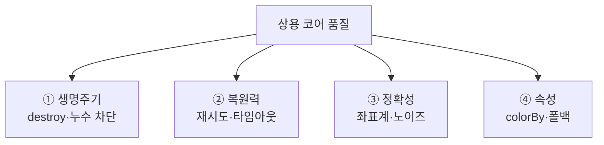
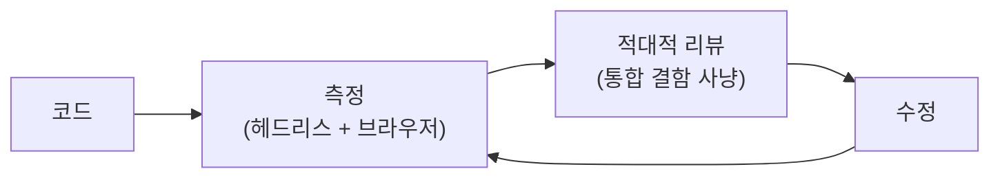

# 06. 상용 코어 — 4기둥

> 한 줄: **다리가 서서 점이 떠도 그건 프로토타입이다.** "돌기만 함"을 "상용 코어 품질"로 끌어올린 네 기둥 —
> 생명주기·복원력·정확성·속성.

[00~05장](00-big-picture.md)이 *어떻게 동작하나*였다면, 이 장은 *왜 안 깨지나*입니다. 입상하려면 핵심 코어가
상용 품질이어야 하고, 그 차이를 네 곳에서 메웠습니다.



## 1. 생명주기

**문제**: 세션·워커·이벤트 리스너가 쌓이고 안 풀리면 누수입니다. tileset 여러 개가 뜨고 지는 동안 전역 상태가
오염됩니다.

**해법**: tileset마다 세션 ID(`sid`)로 추적하고, `tileset.destroy()` 시 그 세션을 정리합니다. **마지막**
세션이 사라지면 워커를 종료하고 서비스워커 리스너도 뗍니다.

```ts
// src/copc-tileset.ts — cleanupIfIdle()
if (activeSids.size > 0) return;           // 아직 살아있는 tileset 있으면 유지
navigator.serviceWorker.removeEventListener('message', messageHandler!);
worker?.terminate();                       // 마지막이면 워커까지 종료
```

Cesium 인스턴스를 감싸지 않고 그 `destroy`만 확장해, 원래 사용법(`tileset.destroy()`)을 그대로 둡니다.

```ts
// src/copc-tileset.ts — fromUrl() : destroy 확장
const tilesetDestroy = tileset.destroy.bind(tileset);
tileset.destroy = () => { releaseSession(sid); tilesetDestroy(); };
```

초기화가 도중에 실패해도 같은 `releaseSession()`으로 누적 상태를 정리한 뒤 에러를 표면화합니다(누수·조용한
실패 둘 다 방지). [05장의 노드 누적](05-hierarchy-paging.md#알려진-한계)을 재는 진단 카운터(`copcNodeCount`)도
여기 붙습니다.

## 2. 복원력

**문제**: 네트워크는 흔들립니다. range 읽기 하나가 실패하면 타일이 실패하고, 더 나쁘게는 — 쓰던 라이브러리가
응답 상태(`response.ok`)를 **안 보고** 5xx 에러 바디를 *점 데이터로 둔갑*시키는 **조용한 실패**가 있었습니다.

**해법**: 모든 range 읽기를 한 getter로 감싸 ① 상태를 검사해 명확히 실패시키고 ② 일시적 실패(429/5xx)는
지수 백오프로 재시도하며 ③ 시도마다 타임아웃을 겁니다. copc.js의 세 경로(header·hierarchy·point)가 모두 이
함수를 거치므로 한 곳에서 전부 커버됩니다.

```ts
// src/copc-core.ts — httpGetterWithRetry()
if (!res.ok) {
  const msg = `COPC range ${begin}-${end}: HTTP ${res.status}`;
  if (!RETRYABLE_HTTP.has(res.status)) throw new AbortError(msg);  // 404 등 결정적 → 즉시 포기
  throw new Error(msg);                                            // 429/5xx → 재시도
}
```

이 랩의 규칙이 여기서 나옵니다: **실패는 반드시 표면화(throw·로그), 무한 대기도 금지.** 결정적 실패는 빨리
죽이고, 일시적 실패만 회복합니다.

## 3. 정확성

**문제**: 점을 지구 위 *제 위치*에 앉히려면 좌표계 변환이 정확해야 합니다. 그리고 측량 데이터엔 노이즈 점(허공의
오검출)이 섞여 있습니다.

**해법 (좌표)**: COPC 헤더의 WKT에서 proj4가 읽을 수 있는 수평 좌표계를 뽑습니다. 복합좌표계(COMPD_CS)면 내부
PROJCS만 괄호 균형으로 잘라내고, 피트 같은 선형 단위는 Z 보정에 씁니다.

```ts
// src/copc-core.ts — extractHorizontalCrs()
if (wkt.startsWith('COMPD_CS') && i >= 0) { /* 내부 PROJCS[...] 만 균형 괄호로 추출 */ }
// → proj4(horiz.proj, WGS84) 로 경위도 변환, zUnit 으로 높이 보정
```

**해법 (노이즈)**: ASPRS 표준 노이즈 분류(7=low, 18=high)를 디코드 단계에서 제외합니다. 측량 표준(PDAL·Potree·
LAStools)과 같은 기본값이고, `[]`를 주면 원본 그대로 봅니다.

```ts
// src/copc-tileset.ts — 기본값
--8<-- "src/copc-tileset.ts:hideClass"
```

## 4. 속성

**문제**: 점은 고도만이 아니라 분류(건물·지면·식생)·강도·리턴 번호로도 칠할 수 있어야 합니다. 그런데 그 차원이
없는 파일이면?

**해법**: `colorBy` 모드별 색을 한 모듈(`src/colors.ts`)에 모읍니다. 해당 차원이 없으면 **조용히 깨지지 않고**
고도 색으로 폴백하며 세션당 한 번 경고합니다.

```ts
// src/copc-core.ts — colorize()
case 'rgb':
  if (has('Red') && has('Green') && has('Blue')) return rgbColors(...);
  break;   // 차원 없으면 아래 폴백으로
// …
if (!warnedFallback.has(s)) { console.warn(`colorBy '${colorBy}' 차원 없음 → height 폴백`); }
return heightColors(zVals, n, zRange);
```

고도 색은 노드별이 아니라 **데이터셋 전역 Z 범위**(COPC 헤더)로 정규화해, 노드가 따로 로드돼도 색이 일관됩니다
(Potree의 elevationRange 방식). 색 로직이 한 곳이라 모드를 추가해도 한 파일에서 끝납니다.

## 측정으로 말한다

네 기둥 모두 추측이 아니라 측정으로 검증했습니다 — 이게 이 프로젝트의 정체성입니다.



서사 버전은 → [learn/06](../learn/06-streaming-engine-and-production-core.md), 진행·측정은 →
[PROGRESS](../PROGRESS.md) · [PROFILING](../PROFILING.md).

## 트랙을 한 장으로

[00 큰 그림](00-big-picture.md)의 한 요청이, [01 동형성](01-public-api-and-isomorphism.md)으로 번역되고,
[02 서비스워커](02-service-worker.md)에 가로채여, [03 워커](03-worker-decode.md)에서 디코드되고,
[04 LOD 위임](04-lod-delegation.md)이 그 요청을 *일으키며*, [05 페이징](05-hierarchy-paging.md)으로 깊이가
펼쳐지고, 이 장의 네 기둥이 그 전체를 **안 깨지게** 받칩니다.

---

← 이전: [05. hierarchy 페이징](05-hierarchy-paging.md) · 처음 → [아키텍처 트랙](index.md) · 큰 그림 → [00](00-big-picture.md)
