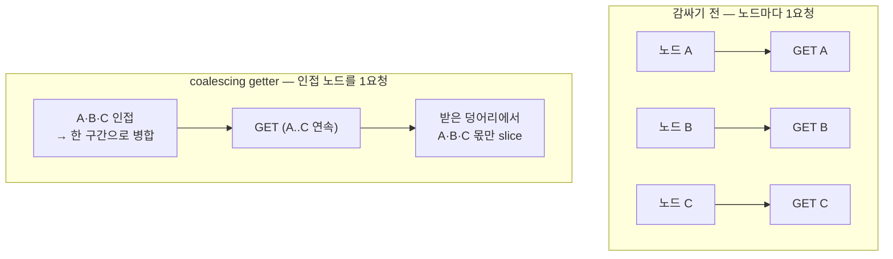

# 07. 적게 요청하기 — range coalescing

> 한 줄: **deep-load가 느린 건 디코드가 느려서가 아니라 요청을 너무 많이 보내서다.** 인접한 노드의
> 바이트를 한 번에 받아 왕복(round-trip) 수를 줄이면, 같은 화면을 상용(Eptium) **동급 속도**로 채운다.

[00장 ④](00-big-picture.md)에서 워커는 노드 하나당 `Range GET`을 한 번 보냈습니다. 화면을 깊게 채울 땐
그 요청이 수십 번이 됩니다 — 이 장은 그 **요청 개수**를 공략합니다.

## 무슨 문제를 푸나

처음엔 deep-load가 느린 게 디코드(laz-perf 압축 해제) 탓인 줄 알았습니다. 그래서 워커를 여러 개로 늘려
봤지만(풀 1 vs N, 같은 뷰) **시간은 그대로**였습니다 — 디코드는 병목이 아니었습니다. 측정해 분해하니
deep-load 시간의 **거의 전부가 range fetch의 왕복비**(요청을 보내고 첫 바이트가 오기까지)였습니다.

그럼 요청을 더 빨리, 더 많이 겹쳐 보내면 될까요? 그 길은 막혀 있습니다 — 브라우저는 한 호스트에
**HTTP/1.1 연결 ~6개**까지만 동시에 엽니다. 그 천장을 억지로 넘기면 가짜 동시성과 타임아웃 폭풍만
생깁니다([04장이 위임한 동시성](04-lod-delegation.md)·[ADR-004](../adr/004-delegate-memory-concurrency-to-cesium.md)).

> 동시성 천장이 고정이라면, 남는 레버는 하나 — **천장을 덜 두드리는 것**, 즉 요청 개수를 줄이는 것.

## 핵심 통찰 — fetch는 비싸고 bytes는 싸다

클라우드에서 부분 읽기를 할 때, **한 번 요청하는 비용(왕복비)** 은 크고 **몇 KB 더 받는 비용** 은 작습니다.
두 노드가 파일 안에서 가깝다면, 사이의 안 쓸 바이트까지 같이 읽어 **한 번에** 가져오는 게, 따로 두 번
왕복하는 것보다 쌉니다.

이건 우리가 발명한 게 아니라 클라우드 최적 포맷을 다루는 스택의 표준입니다 — GDAL `/vsicurl`의 range
merge, fsspec의 `merge_ranges`, Zarr/kerchunk의 prefetch가 전부 같은 패턴입니다. COPC도 정확히 이런
"클라우드 위에서 부분 읽기" 포맷이라 그대로 들어맞습니다. (copc.js·PDAL·Potree 어디에도 없던, 우리 코어의
차별점입니다.)

## 어떻게 — getter 하나를 감싼다

비결은 **디코드 경로를 한 줄도 안 바꾸는** 것입니다. copc.js가 바이트를 읽을 때 쓰는 `getter` 함수를
얇게 감싸(데코레이터), 들어온 요청이 "어느 노드의 점 데이터"인지 알아채고 인접 노드를 묶어 **한 번에**
받은 뒤, 받은 큰 덩어리에서 그 노드 몫만 **잘라서**(slice) 돌려줍니다.



```ts
// src/copc-core.ts — createCoalescingGetter() (개념)
// 들어온 (begin,end) 가 어떤 노드의 point-data 면 → 그 노드를 인접 노드와 묶은
// 연속 구간(run)을 한 번에 받아 region 캐시에 넣고, 필요한 부분만 잘라 돌려준다.
const region = await fetchRun(run);            // 인접 노드까지 한 번에
return region.slice(begin - run.start, end - run.start);  // 이 노드 몫만
```

노드 데이터가 아닌 요청(헤더·서브페이지 메타)은 **그대로 통과**시킵니다 — 가볍고 패턴이 달라 묶을
이득이 없습니다.

## 얼마나 묶나 — 두 개의 상한 (two-cap)

병합은 공짜가 아닙니다. 너무 공격적으로 묶으면 **안 쓸 바이트를 너무 많이** 읽고, 한 덩어리가 너무 커지면
그 GET 하나가 느려져 동시성을 죽입니다. 그래서 두 상한을 **동시에** 겁니다:

- **gap 상한** — 두 노드 사이 빈틈이 이보다 크면 안 묶는다 (낭비 바이트 제한).
- **size 상한** — 묶은 덩어리가 이보다 커지면 끊는다 (GET 하나가 너무 비대해지지 않게).

둘 중 하나라도 어기면 새 그룹을 시작합니다. 이 두 노브가 "왕복 절감 ↔ 낭비·지연"의 균형점이고, 값은
prior art(`/vsicurl` 등)의 관행을 따랐습니다. (정확한 기본값은 [ADR-006](../adr/006-range-coalescing.md).)

## 정확성의 함정 — octree 순서 ≠ byte 순서

가장 미묘한 위험: **COPC는 옥트리 키 순서가 파일 바이트 순서와 같다고 보장하지 않습니다.** 노드를 키
순서로 묶으면, 실제로는 파일 여기저기 흩어진 구간을 "연속"이라 착각해 엉뚱한 바이트를 잘라낼 수 있습니다.
그래서 병합은 반드시 **실제 byte offset으로 정렬한 뒤** 인접성을 판단합니다.

이건 측정으로 못 박았습니다 — 병합해 받아 자른 노드별 바이트가, per-node로 따로 받은 것과
**byte-identical**(골든파일)이어야만 통과합니다. 같은 점을 그리는데 왕복 수만 줄어든 것을 바이트 단위로
증명한 셈입니다.

## 측정으로 말한다

같은 데이터·같은 화면(millsite, 실 GPU)에서 — range 왕복이 **10배 가까이 줄고**, deep-load 정착 시간이
**~3배 빨라져** 상용 Eptium과 동급이 됐습니다. 렌더된 점 개수는 한 점도 안 변했습니다(정확성 회귀 0).
노브를 끄면(`coalesceMaxGap: 0` / 데모 `?coalesce=0`) 기존 per-node 동작으로 폴백합니다 — A/B가 가능합니다.

| | coalescing 전 | 후 |
|--|--|--|
| range 왕복 | 많음(노드마다) | **대폭 감소** (인접 묶음) |
| deep-load 정착 | 상용 대비 느림 | **상용 동급** |
| 렌더 점수·바이트 | — | **불변 (byte-identical)** |

> 정확한 수치(왕복 61→6·정착 13.9s→4.8s·peak 메모리 트레이드오프)와 캐시·동시요청 공유(region-LRU,
> in-flight dedup)의 깊은 디테일은 위키에 → [range-coalescing](../wiki/range-coalescing.md) ·
> 배경/결정은 [ADR-006](../adr/006-range-coalescing.md) · 진단 과정은 [이슈 #02](../issues/02-deep-load-worker-pool.md).

## 트랙에서의 자리

[06장](06-production-core.md)이 "안 깨지게"(견고성)였다면, 이 장은 **"빠르게"**(IO 효율)입니다. 둘이 합쳐
북극성 — *변환 없이, 빠르고, 부드럽게* — 의 "빠르게"를 상용 동급으로 끌어올립니다.

---

← 이전: [06. 상용 코어 — 4기둥](06-production-core.md) · 처음 → [아키텍처 트랙](index.md) · 큰 그림 → [00](00-big-picture.md)
