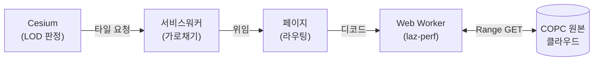

# 아키텍처 — 코드로 읽는 설계

> `learn/` 커리큘럼이 **"왜 이 스택을 골랐나"**(개념 배경)라면, 이 트랙은 **"우리가 만든 시스템이 실제로 어떻게 동작하나"**를
> 큰 그림 → 디테일로, **실제 코드와 다이어그램**으로 따라갑니다.

## 한 문장으로 본 시스템

이 프로젝트의 결과물은 한 줄짜리 API입니다.

```ts
const tileset = await CopcTileset.fromUrl(url);   // COPC 파일 URL 하나
viewer.scene.primitives.add(tileset);             // 끝. 변환 없이 LOD 스트리밍.
```

이 한 줄 뒤에서 무슨 일이 벌어지는가 — 그게 이 트랙 전체의 주제입니다.

## 세 학습 트랙의 역할

| 트랙 | 답하는 질문 | 성격 |
|------|------------|------|
| [커리큘럼](../learn/index.md) | 포인트클라우드·COPC·Cesium·좌표계는 *무엇*인가 | 개념 배경 |
| **아키텍처 (여기)** | 우리 시스템이 *어떻게* 동작하나 | 코드 + 다이어그램 설계 투어 |
| [위키](../wiki/index.md) | 특정 메커니즘의 *깊은* 디테일 | 합성 노트 |

겹치는 내용은 베끼지 않고 링크로 잇습니다. 막히면 위키·[ADR](../adr/001-provider-plugin-architecture-A.md)로 더 파고들 수 있습니다.

## 읽는 순서

| # | 페이지 | 한 줄 |
|---|--------|-------|
| 00 | [큰 그림 — 한 요청의 일생](00-big-picture.md) | 타일 하나가 화면에 뜨기까지 전체 흐름 |
| 01 | [공개 API와 동형성](01-public-api-and-isomorphism.md) | URL→Tileset, 옥트리와 3D Tiles가 닮은 이유 |
| 02 | [서비스워커 — 요청 가로채기](02-service-worker.md) | Cesium은 COPC를 모른다 |
| 03 | [워커 디코드 — 메인스레드 밖](03-worker-decode.md) | 무거운 디코드를 어디서 하나 |
| 04 | [LOD 위임 — Cesium에게 맡긴다](04-lod-delegation.md) | "언제 어느 노드"를 손코딩하지 않는 법 |
| 05 | [hierarchy 페이징 — 본 만큼만 깊이](05-hierarchy-paging.md) | 대용량 옥트리를 lazy 확장 |
| 06 | [상용 코어 — 4기둥](06-production-core.md) | 생명주기·복원력·정확성·속성 |
| 07 | [적게 요청하기 — range coalescing](07-range-coalescing.md) | 인접 노드를 한 번에 받아 deep-load를 상용 동급으로 |

## 큰 그림 한 장

타일 하나를 요청하면 **Cesium · 서비스워커 · 페이지 · Web Worker** 네 배우가 차례로 손을 거칩니다.
이 그림을 한 화살표씩 따라가는 게 [00. 큰 그림](00-big-picture.md)입니다.



다음 → [00. 큰 그림 — 한 요청의 일생](00-big-picture.md)
