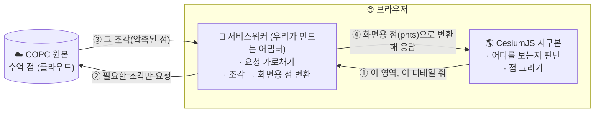
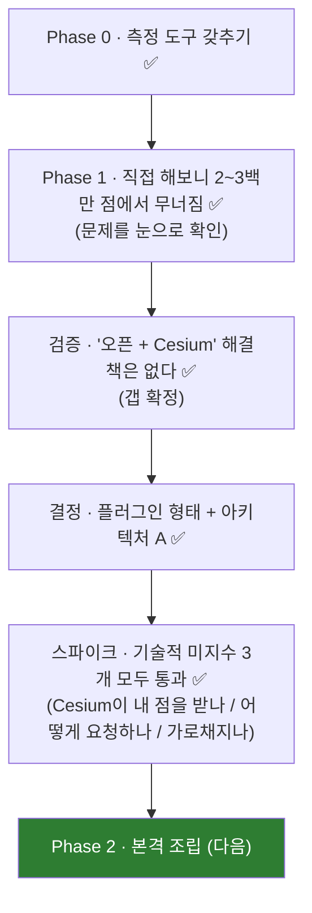

# CopcCesiumLab — 한눈에 이해하기

> **거대한 3D 점 데이터(COPC)를, 변환 없이, 웹 지구본(CesiumJS)에 부드럽게 띄우는 오픈소스 도구를 만드는 프로젝트.**
> (2026 오픈소스 개발자대회 · 가이아쓰리디 지정과제)

이 페이지만 읽어도 *무엇을, 왜, 어떻게* 하는지 전부 잡히도록 친절하게 정리했습니다. 더 깊은 내용은 왼쪽 메뉴로.

---

## 1. 한 문장으로

> 드론·라이다가 찍은 **수억 개의 점**을, 미리 가공하지 않고 **원본 파일 그대로**, 웹 지도 위에 **필요한 만큼만 실시간으로** 그려주는 라이브러리.

---

## 2. 왜 어려울까? (친절하게)

점 하나하나가 모여 도시·지형이 됩니다. 그런데 그 점이 **수억~수십억 개**라, 한 번에 다 받지도 그리지도 못합니다.

!!! note "직접 해보니 (측정)"
    순진하게 "전부 불러와 그리기"를 했더니 **약 200~300만 점에서 멈췄습니다** (메모리 4GB, 화면 17fps). 점은 100억 개도 있는데 말이죠.

해법은 **Google 지도와 같은 발상**입니다 — 온 세상을 다 받지 않고, *지금 보는 곳만, 필요한 만큼만* 조각조각 가져옵니다. 가까이 보면 자세히, 멀리 보면 듬성듬성. 이걸 **LOD 스트리밍**이라고 합니다.

그리고 **"변환 없이"** 가 핵심입니다. 보통은 원본을 미리 다른 포맷(3D Tiles)으로 *갈아엎어야* 웹에 띄울 수 있는데 — 그건 비싸고, 저장소도 2배 들고, 원본이 바뀔 때마다 다시 해야 합니다. 우리는 **원본 COPC를 그대로** 띄웁니다.

---

## 3. 전체 그림 (이렇게 동작합니다)

**읽는 법:** 지구본(Cesium)이 "지금 화면에 이만큼 필요해"라고 우리 어댑터에게 묻고(①), 어댑터는 원본에서 **딱 그 조각만** 가져와(②③) 화면용으로 바꿔 돌려줍니다(④). 카메라가 움직이면 이 과정이 반복됩니다. **전체를 절대 다 들지 않습니다.**

!!! tip "왜 이 구조가 영리한가"
    "언제 무엇이 필요한지"는 **Cesium이 이미 잘 합니다.** 우리는 "그럼 그 조각 여기 있어"만 답하면 됩니다 — LOD 판단을 직접 만들지 않고 Cesium에 맡기는 거죠.

---

## 4. 그런데 왜 아무도 안 만들었을까? (= 우리 기회)

점군 뷰어 자체는 오픈소스로 여럿 있습니다. **단, 전부 Cesium이 아닌 다른 엔진**으로 만들어졌습니다.

| 이미 있는 오픈 뷰어 | 어떤 엔진 위에 |
|---|---|
| Potree · Giro3D · deck.gl | Three.js · 자체 WebGL (Cesium 아님) |
| **(없음)** | **Cesium** ← 여기만 비어 있음 |

Cesium용 완성품은 **상용(Eptium)** 하나뿐이고 닫혀 있습니다. 직접 확인해보니, "COPC + Cesium" 이름의 오픈 저장소는 **딱 하나 있는데 코드가 0줄인 빈 껍데기**였습니다. → **남들도 이 빈칸을 봤지만 안 만들었다 = 진짜 기회.**

!!! warning "왜 비어 있나 (핵심 허들)"
    Cesium은 훌륭하지만 "외부에서 만든 점을 실시간으로 받는" 깔끔한 통로가 없습니다. 그래서 **서비스워커로 요청을 가로채는** 다리를 직접 놔야 합니다. 이 다리가 어렵기 때문에 비어 있었고, 우리가 채우려는 부분입니다.

---

## 5. 여기까지 증명한 것 (여정)

말이 아니라 **측정**으로 한 단계씩 확인하며 왔습니다.

→ 이제 **"될까?"는 사라졌습니다.** 남은 건 알려진 조립뿐입니다.

---

## 6. 현재 상태

- ✅ 문제·범위 정의, 갭 검증, 아키텍처 결정 (ADR-001)
- ✅ 핵심 3대 기술 스파이크 통과 (다리 존재 + 온디맨드 가로채기)
- ⏳ Phase 2 본편: COPC 디코드를 서비스워커로 이동 → 옥트리 전체 → 캐시 → `CopcTileset.fromUrl()` API

---

## 더 읽어보기

- **개념부터** → [학습 커리큘럼](learn/index.md) (점군 · COPC · CesiumJS · 좌표계 · 통합)
- **무엇을 푸나** → [문제 정의](PROBLEM.md) · [경쟁 전략](STRATEGY.md)
- **무엇을 쟀나** → [측정 결과](RESULTS.md) · [4축 진단법](PROFILING.md)
- **왜 그렇게 정했나** → [ADR-001](adr/001-provider-plugin-architecture-A.md) · [prior art 지도](REFERENCES.md)
- **어디까지 왔나** → [진행 상태](PROGRESS.md)

> 이 사이트는 `docs/` 의 마크다운을 사람이 읽기 좋게 발행한 것입니다. (md = 작업용, 이 HTML = 학습용)
