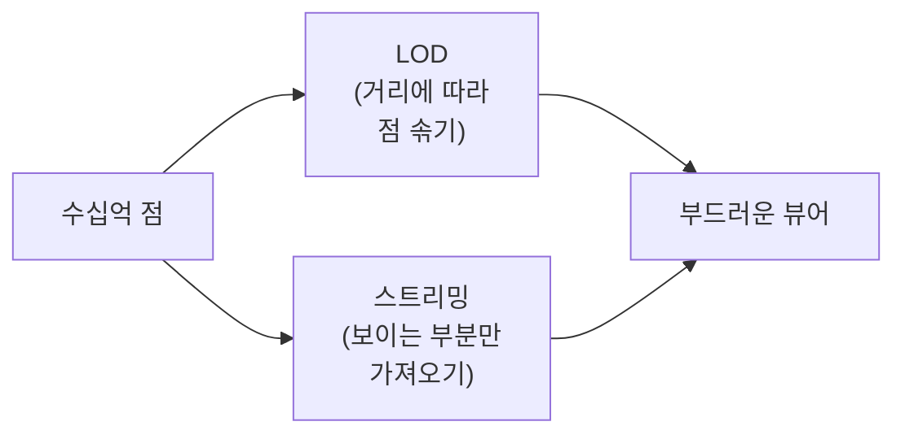

# 01. 포인트클라우드(Point Cloud) 기초

## 포인트클라우드란

**3D 공간에 흩뿌려진 점들의 집합**입니다. 각 점은 위치 `(X, Y, Z)`와 여러 **속성(attribute)**을 가집니다. 면(face)도, 변(edge)도, 연결 정보(토폴로지)도 없습니다 — 오직 독립적인 점들의 나열입니다.

이 "토폴로지 없음"이 포인트클라우드의 모든 성격을 결정합니다. 메시는 적은 수의 정점으로 큰 표면을 표현하지만, 포인트클라우드는 표면을 **점의 밀도**로만 암시합니다. 그래서 같은 장면을 표현하는 데 압도적으로 많은 데이터가 필요합니다.

## 점은 어디서 오나

| 출처 | 방식 | 특징 |
|------|------|------|
| **항공 LiDAR** | 비행기/드론에서 레이저 거리측정 | 넓은 지형, 위에서 |
| **지상 LiDAR (TLS)** | 삼각대 스캐너 | 고밀도, 국소 |
| **모바일 LiDAR (MLS)** | 차량/배낭 + IMU/GNSS | 도로·시가지 |
| **사진측량 (SfM)** | 여러 사진에서 3D 복원 | 색 정보 풍부 |

LiDAR는 "레이저를 쏘고 돌아오는 시간으로 거리를 잰다"를 초당 수십만~수백만 번 반복합니다. 그 결과가 포인트클라우드입니다.

## 점이 가진 속성 (LAS 표준 기준)

위치 외에 점마다 따라붙는 대표 속성들:

- **Intensity** — 반사 강도 (재질·표면 추정에 사용)
- **RGB** — 색 (있을 수도, 없을 수도)
- **Classification** — 분류 코드 (지면/건물/식생/물 등, ASPRS 표준 코드)
- **Return Number / Number of Returns** — 한 펄스가 여러 번 되돌아옴 (나뭇잎→가지→지면). 식생 투과 분석의 핵심
- **GPS Time** — 측정 시각
- **Scan Angle, Point Source ID** — 스캔 기하·소스 식별

!!! note "왜 속성이 중요한가"
    렌더링·필터링이 전부 속성 기반입니다. "지면만 보기"(classification), "고도로 색칠"(Z), "강도로 음영"(intensity) 등. 우리 뷰어도 결국 이 속성들을 GPU에 올려 색을 칠합니다.

## 왜 무거운가 — 이 프로젝트의 출발점

- 한 데이터셋이 **수백만~수십억 점**입니다. 국가 단위는 조 단위도 됩니다.
- 점 하나가 위치(12~24바이트) + 속성 → 수 GB~수 TB.
- 토폴로지가 없어 "멀리 있으면 면을 줄인다" 같은 메시식 단순화가 안 통합니다. 대신 **점을 솎아내는(decimation) 다단계 표현**이 필요합니다.

그래서 포인트클라우드 기술의 거의 모든 노력은 두 가지로 수렴합니다:

→ 이 두 가지를 파일 포맷 수준에서 해결한 것이 다음 장의 **COPC**입니다.

## 점은 화면에 어떻게 그려지나

점은 **point sprite**(화면상 정사각/원형 스프라이트)로 그립니다. 핵심 렌더 요소:

- **point size** — 점 크기(픽셀). 크면 빈틈이 메워지지만 overdraw(겹쳐 그리기)가 늘어 fill-rate를 먹습니다.
- **attenuation** — 거리에 따른 크기 감쇠 (가까운 점 크게, 먼 점 작게)
- **Eye-Dome Lighting (EDL)** — 점들의 깊이 차이로 윤곽을 강조해 형상감을 주는 스크린 후처리

!!! tip "성능 직관"
    포인트클라우드 렌더는 **vertex 수**(점 개수)와 **fill-rate**(point size·overdraw) 두 압력을 받습니다. 둘 중 무엇에 묶였는지 가르는 게 [4축 병목 진단](../PROFILING.md)의 ④ GPU 축입니다.

---

→ 다음: [02. COPC 포맷](02-copc.md) — 이 무거운 포인트클라우드를 "변환 없이 웹 스트리밍"으로 만든 파일 포맷.
