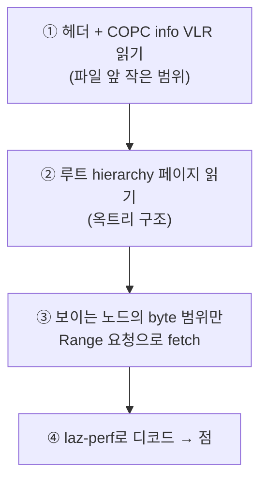

# 02. COPC 포맷

COPC를 이해하려면 그 조상인 **LAS → LAZ → (EPT) → COPC**의 진화를 보는 게 가장 빠릅니다. 각 단계는 바로 앞 단계의 한계를 푼 것입니다.

## LAS — 포인트클라우드의 표준 컨테이너

**LAS**는 ASPRS(미국 사진측량·원격탐사학회)가 정한 LiDAR 포인트클라우드 표준 바이너리 포맷입니다. 구조:

```
[Public Header Block]  ← 점 개수, 좌표 scale/offset, min/max, 포맷 버전
[VLRs]                 ← 가변 길이 레코드 (CRS 정보, 메타데이터)
[Point Records]        ← 실제 점들 (고정 길이 레코드의 연속)
[EVLRs]                ← 확장 VLR (파일 끝)
```

핵심 두 가지:

- **점은 정수로 저장됩니다.** `world = int값 × scale + offset`. 헤더의 `scale`(예: 0.01)과 `offset`이 정수를 실제 좌표로 되돌립니다. 부동소수 대신 정수+스케일을 쓰는 이유는 압축률과 정밀도 제어 때문입니다.
- **PDRF (Point Data Record Format)** 0~10: 점 레코드의 필드 구성. PDRF 6/7/8이 최신(GPS time·RGB 등 포함)이며 COPC는 이들을 씁니다.

## LAZ — 압축된 LAS

**LAZ**는 LAS를 **LASzip**으로 압축한 것입니다. 점 데이터를 **청크(chunk)** 단위로 압축해 보통 원본의 1/5~1/10 크기가 됩니다. 디코딩에는 **laz-perf**(WebAssembly로 포팅된 디코더)를 씁니다 — 우리 프로젝트가 `copc` 패키지를 통해 쓰는 바로 그 라이브러리입니다.

!!! warning "LAS/LAZ의 한계"
    LAS/LAZ는 **통째로 받아야** 의미가 있습니다. 점들이 공간 순서 없이 저장돼 있어서, "화면에 보이는 이 영역의 개요만"을 골라 읽을 수 없습니다. 수 GB 파일을 웹에서 그대로 쓰기 불가능한 이유입니다.

## EPT — 옥트리로 쪼개기 (그러나 수만 개 파일)

**EPT(Entwine Point Tiles)**는 포인트클라우드를 **옥트리**로 재구성해 LOD·스트리밍을 가능케 했습니다. 하지만 결과물이 **디렉토리 + 수천~수만 개의 작은 파일 + 인덱스**입니다. 관리·배포·전송(파일마다 HTTP 요청)이 번거롭습니다.

## COPC — 옥트리를 단일 파일 안에

**COPC(Cloud Optimized Point Cloud)**의 한 줄 정의:

> **유효한 LAZ 1.4 단일 파일인데, 내부 점 데이터가 클러스터드 옥트리로 재배열되어 있고, HTTP Range 요청으로 필요한 부분만 읽을 수 있다.**

즉 EPT의 "옥트리 LOD"를 LAZ "단일 파일" 안에 집어넣은 것입니다. 별도 사이드카 없이 파일 하나. 래스터 세계의 **COG(Cloud Optimized GeoTIFF)** 와 같은 발상의 포인트클라우드 버전입니다.

### 어떻게 "필요한 부분만" 읽나



클라이언트는 파일 전체가 아니라 **바이트 범위(Range 헤더)** 로 조각조각 가져옵니다. 카메라에 보이는 영역 + 필요한 디테일 수준의 노드만.

### 옥트리 구조

루트 큐브(`info.cube`)를 8개로 재귀 분할합니다. 각 노드의 키는 **`깊이-X-Y-Z`** 형식, 루트는 **`0-0-0-0`**.

- **얕은 노드** = 성긴 점(전체 개요). **깊은 노드** = 조밀한 점(국소 디테일).
- 즉 **각 깊이가 곧 하나의 LOD 레벨**입니다. 멀리서 보면 얕은 노드만, 가까이 가면 깊은 노드까지.
- 각 노드는 `pointCount`와 파일 내 **byte offset/length**를 가집니다 → 이게 Range 요청의 좌표.

### `spacing`

루트 노드의 **점 간 평균 간격(미터)**. 깊이가 1 내려갈 때마다 절반이 됩니다. 이 값이 나중에 Cesium의 LOD 판단(geometricError)으로 매핑됩니다 → [05장](05-copc-cesium-integration.md).

## copc.js가 우리에게 주는 것 (직접 확인함)

설치된 `copc` 패키지(v0.0.8)의 실제 API. 이것이 우리 프로토타입의 데이터 레이어 전부입니다:

```ts
import { Copc, Getter } from 'copc';

// ① HTTP range getter가 내장 — range fetcher를 직접 짤 필요 없음
const copc = await Copc.create(Getter.http(url));
//   copc.header : scale, offset, min/max, pointCount, PDRF ...
//   copc.info   : cube, spacing, rootHierarchyPage ...
//   copc.wkt    : 좌표계(CRS) — 04장 georeferencing의 입력

// ② 옥트리 계층 읽기
const { nodes } = await Copc.loadHierarchyPage(url, copc.info.rootHierarchyPage);
const root = nodes['0-0-0-0'];

// ③ 한 노드의 점 데이터 읽기 + 디코드 (laz-perf 내부 사용)
const view = await Copc.loadPointDataView(url, copc, root);
const [getX, getY, getZ] = ['X', 'Y', 'Z'].map(view.getter);
//   view.dimensions 로 사용 가능한 속성 확인, view.getter('Red') 등으로 추출
```

!!! success "BP 조사 결론"
    `①` 네트워크(Range), `②` 디코드(laz-perf), 옥트리 파싱이 **전부 라이브러리 안**에 있습니다. 우리가 만들 것은 "이 점들을 Cesium에 먹이고, 언제 어느 노드를 부를지 결정하는 LOD 스트리밍 글루"입니다. 자세히는 [05장](05-copc-cesium-integration.md).

## "변환 없이"가 왜 핵심인가

전통적 워크플로우는 이랬습니다:

```
LAS/LAZ → (서버에서 entwine / py3dtiles 로 변환) → 3D Tiles → 웹 서빙
```

이 변환 단계는 시간·저장소·파이프라인 운영 비용입니다. COPC는 **원본 파일을 브라우저가 직접 Range로 읽어** 이 변환 단계를 통째로 없앱니다. 가이아쓰리디 과제의 슬로건 *"복잡한 변환 없이 웹 지도에 바로"* 가 정확히 이것을 가리킵니다.

---

→ 다음: [03. CesiumJS](03-cesiumjs.md) — 이 점들을 그려줄 웹 3D 지구본 엔진.
