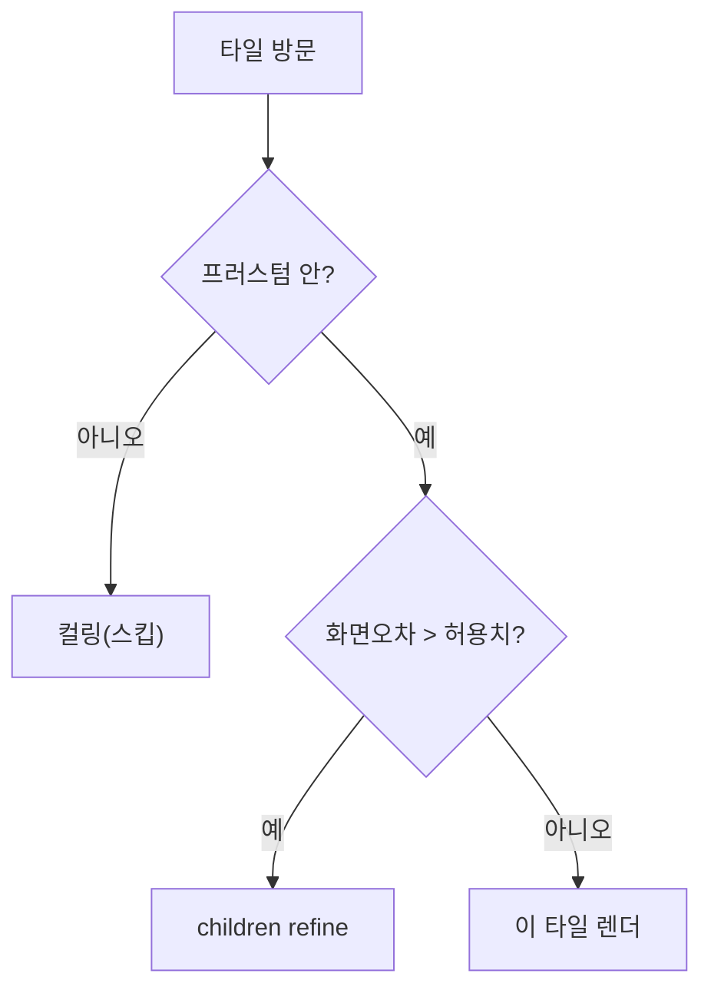

# 03. CesiumJS

## 무엇인가

**CesiumJS**는 브라우저에서 **지구 전체 스케일의 3D 지구본**을 그리는 오픈소스 WebGL 라이브러리입니다. 위성 영상·지형·건물·점군을 실제 지구 위 정확한 위치에 띄웁니다. 우리는 이걸 "점군 렌더 엔진"으로 쓰되, 더 중요하게는 **이미 완성된 LOD·스트리밍 기계**로 활용하려 합니다.

## 좌표계 — Cesium은 지구중심 직교좌표로 생각한다

Cesium 내부의 기준 좌표는 **ECEF(Earth-Centered, Earth-Fixed)** 직교좌표입니다.

- 원점 = **지구 중심**, 단위 = **미터**. 타입은 `Cartesian3 (x, y, z)`.
- 사람이 읽는 좌표는 **Cartographic** = `(경도, 위도, 높이)`, 각도는 **라디안**.
- 변환: `Cesium.Cartesian3.fromDegrees(lon, lat, height)` 등.

!!! warning "지구 크기 좌표의 정밀도 문제"
    지구 중심 기준 좌표값은 수백만(미터) 단위입니다. 이를 `float32`로 그대로 GPU에 넣으면 정밀도가 모자라 **떨림(jitter)**이 생깁니다. Cesium은 좌표를 어떤 중심에 대한 상대값으로 표현하는 **RTC(Relative-To-Center)** 기법 등으로 이를 해결합니다. 점군도 좌표값이 크므로 같은 문제를 겪습니다 → [04장 georeferencing](04-coordinate-systems.md)에서 다룹니다.

## 무엇으로 구성되나

| 레이어 | 역할 |
|--------|------|
| **Imagery** | 위성/지도 타일 (지표면 텍스처) |
| **Terrain** | 지형 고도 메시 |
| **3D Tiles (Tileset)** | 대용량 3D 콘텐츠 스트리밍 — **점군이 여기 속함** |
| **Entities / Primitives** | 개별 객체(점·선·모델). 저수준 직접 렌더는 Primitive |

## 3D Tiles — 핵심 중의 핵심

**3D Tiles**는 대용량 3D 지오데이터(건물·점군·포토그래메트리)를 스트리밍하기 위한 OGC 표준입니다. 우리 프로젝트의 핵심 설계 가설이 "COPC를 3D Tiles처럼 보이게 만들어 Cesium에 먹인다"이므로, 이 구조를 정확히 알아야 합니다.

### tileset.json — 타일 트리

```
tileset.json
└─ root tile
   ├─ boundingVolume   (이 타일이 덮는 공간)
   ├─ geometricError   (이 타일을 안 쪼개고 보여줄 때의 "기하 오차", 미터)
   ├─ content          (실제 데이터: pnts / b3dm / glTF ...)
   └─ children[]       (더 정밀한 하위 타일들)
```

이 트리가 **옥트리와 똑같은 구조**라는 점을 주목하세요. COPC 옥트리 ↔ 3D Tiles 타일 트리의 매핑이 자연스럽기 때문에 통합이 가능합니다.

### SSE — Cesium이 LOD를 결정하는 방식

Cesium은 매 프레임 타일 트리를 순회하며 각 타일에 대해 묻습니다:

> 이 타일의 `geometricError`를 현재 카메라 거리에서 화면 픽셀 오차로 환산하면 몇일까?

- 그 값이 `maximumScreenSpaceError`(기본 16)보다 **크면** → 부족하다 → **children으로 내려가 더 정밀하게(refine)**.
- **작으면** → 충분하다 → 이 타일을 렌더하고 멈춤.



**이 SSE 순회 + 프러스텀 컬링 + 요청 스케줄링 + 메모리 캐시가 전부 Cesium에 내장**되어 있습니다. 우리가 COPC 옥트리에 적절한 `geometricError`만 부여하면, "언제 어느 노드를 보여줄지"를 Cesium이 알아서 결정합니다. 이게 Cesium 재사용의 결정적 이점입니다.

### pnts — 점군 타일 포맷

3D Tiles 1.0의 점군 콘텐츠 포맷. 바이너리로 **feature table**(위치·색·노멀)과 batch table을 담습니다. (3D Tiles 1.1에서는 점군을 glTF로도 표현 가능.) A안에서 우리는 COPC 노드의 점을 이 pnts(또는 동등 표현)로 만들어 Cesium에 넘기게 됩니다.

## 점군 렌더 제어

- `tileset.pointCloudShading.attenuation` — 거리 기반 점 크기 감쇠
- `tileset.pointCloudShading.eyeDomeLighting` — 윤곽 강조(형상감)
- `tileset.maximumScreenSpaceError` — LOD 공격성(낮을수록 디테일↑·부하↑)
- `tileset.cacheBytes` — 점 메모리 캐시 크기
- `scene.requestRenderMode = true` — 변화가 있을 때만 렌더 (정지 시 GPU 절약)

## 디버깅 훅 (우리가 쓸 것)

```ts
scene.debugShowFramesPerSecond = true;        // FPS/ms
tileset.debugShowRenderingStatistics = true;  // 선택 타일·렌더 점 수 (측정 기준선)
tileset.debugShowMemoryUsage = true;          // GPU 메모리
tileset.debugShowBoundingVolume = true;       // 타일 경계 박스 (컬링/배치 확인)
```

이들이 [4축 병목 진단](../PROFILING.md)의 측정 도구입니다.

---

→ 다음: [04. 좌표계와 georeferencing](04-coordinate-systems.md) — 점군을 지구 위 *정확한 위치*에 앉히기.
