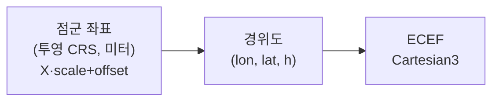

# 04. 좌표계와 georeferencing

점군을 화면에 "그리는" 것과 지구 위 "정확한 위치에 앉히는" 것은 다른 문제입니다. 후자가 **georeferencing**이고, 점군 뷰어 버그의 가장 흔한 출처입니다.

## CRS — 좌표가 무엇을 기준으로 하는가

**CRS(Coordinate Reference System, 좌표참조계)**는 숫자 좌표가 지구상 어디를 뜻하는지 정의합니다. 크게 두 종류:

| 종류 | 단위 | 예 | 쓰임 |
|------|------|-----|------|
| **지리좌표 (Geographic)** | 도(degree) | WGS84 = **EPSG:4326** (경위도) | 전지구 |
| **투영좌표 (Projected)** | 미터 | UTM (EPSG:326xx), Web Mercator (EPSG:3857), 한국 EPSG:5186/5179 | 국소·측량 |

**투영**은 둥근 지구를 평면 미터 격자로 펴는 것입니다. 국소 영역에서 거리·면적이 정확해 측량·점군에 적합하지만, 영역마다 다른 투영(예: UTM zone)을 씁니다.

!!! note "EPSG 코드"
    각 CRS에는 `EPSG:번호` 식별자가 붙습니다. 좌표를 다룰 때 "이 데이터의 EPSG가 뭔가"가 항상 첫 질문입니다.

## 점군의 좌표계는 보통 투영좌표다

점군은 미터 단위 정밀 작업이 많아 **투영좌표(로컬 미터)**로 저장되는 게 일반적입니다. 그 CRS 정보는 LAS 파일 안에 **WKT**(또는 GeoTIFF VLR)로 들어 있습니다.

- COPC에서는 `copc.wkt` 로 읽습니다 ([02장](02-copc.md) 참고).
- WKT 예: `PROJCS["WGS 84 / Pseudo-Mercator", ... AUTHORITY["EPSG","3857"]]` → EPSG:3857.

## georeferencing — 점을 ECEF로 옮기기

[03장](03-cesiumjs.md)에서 봤듯 Cesium은 **ECEF**(지구중심 직교, 미터)로 동작합니다. 그래서 변환 사슬이 필요합니다:

도구:

- **proj4js** — 원본 투영 CRS → 경위도 재투영. (WKT/EPSG로 변환 정의)
- **Cesium** — 경위도 → ECEF: `Cartesian3.fromRadians(lon, lat, h)`, 또는 로컬 프레임 행렬 `Transforms.eastNorthUpToFixedFrame(origin)`.

## 두 가지 전략 (정확도 vs 속도)

| 전략 | 방법 | 장단 |
|------|------|------|
| **(a) 점별 재투영** | 모든 점을 proj4로 경위도→ECEF | 정확. 수억 점이면 매우 비쌈 |
| **(b) 로컬 ENU 프레임** | 데이터셋 중심 1점만 ECEF로, 점은 그 프레임의 로컬 오프셋(model matrix) | 빠름. 국소적으로 정확, 넓은 영역은 곡률 오차 |

실무는 보통 **(b)** 를 씁니다 — 중심에 East-North-Up 프레임을 잡고 점은 미터 오프셋으로 두면, GPU에 작은 수가 들어가 [정밀도 떨림](03-cesiumjs.md) 문제도 같이 완화됩니다. 영역이 매우 크면 노드(타일)별로 프레임을 보정합니다.

## georeferencing 버그 = 디버깅 핫스팟

점군이 "안 보인다"의 대부분은 렌더가 아니라 **위치가 틀려서**입니다. 증상과 원인:

| 증상 | 흔한 원인 |
|------|----------|
| 지구 반대편/우주에 있음 | CRS 오인식, WKT 누락, 경위도 뒤바뀜(lat/lon 순서) |
| 땅속에 묻힘 / 공중에 뜸 | 높이 기준 불일치 (타원체고 vs 정사고도) |
| 90°/180° 회전됨 | 축 순서, ENU 프레임 방향 오류 |
| 스케일이 이상함 | scale/offset 미적용, 도(degree)를 미터로 오해 |

!!! warning "높이 기준 (height datum)"
    **타원체고(ellipsoidal height)** = 수학적 타원체 기준. **정사고도(orthometric height)** = 해수면(지오이드) 기준. Cesium은 기본적으로 타원체고를 기대합니다. 점군이 정사고도면 **지오이드 보정**(예: EGM 모델)이 필요하며, 안 하면 수십 미터 위/아래로 어긋납니다.

→ 이 표가 곧 Phase 1에서 점이 안 보일 때 **추측 대신 체크할 목록**입니다.

---

→ 다음: [05. 통합과 LOD 스트리밍](05-copc-cesium-integration.md) — COPC와 Cesium을 잇는 이 프로젝트의 본체.
