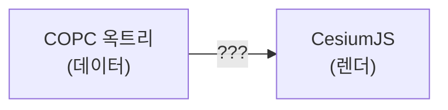
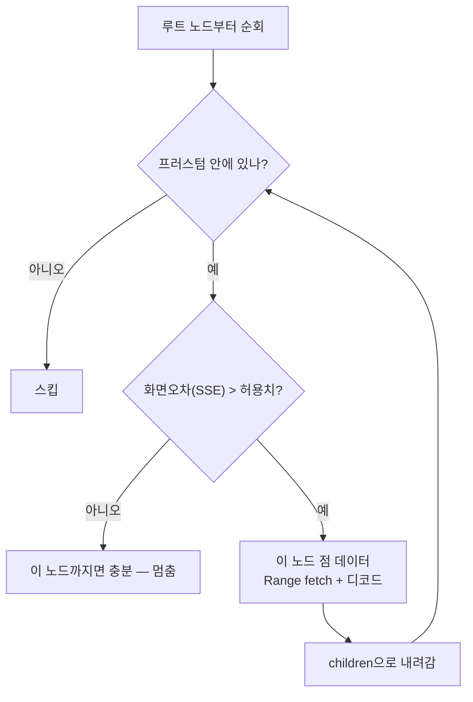
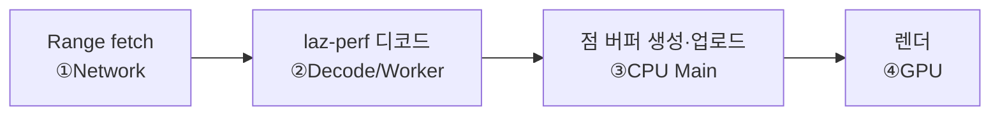
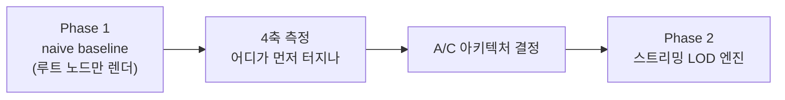

# 05. 통합과 LOD 스트리밍

앞 4장이 부품이었다면, 이 장이 **조립**입니다. 그리고 여기가 이 프로젝트의 실제 난관이자, 오픈소스로 비어 있는 갭입니다 ([REFERENCES.md](../REFERENCES.md) 참고).

## 문제 정의

이 `???` 가 두 개의 질문입니다:

1. **어떻게** COPC 점을 Cesium에 먹이나 (렌더 통합)
2. **언제 어느 노드**를 가져오나 (LOD 스트리밍)

## 질문 1 — 렌더 통합의 3가지 길

[REFERENCES.md](../REFERENCES.md)에서 정리한 3안:

| 옵션 | 방식 | 핵심 트레이드오프 |
|------|------|------------------|
| **A. on-the-fly 3D Tiles** | COPC 옥트리 → 메모리상 가짜 tileset + pnts → Cesium 네이티브 렌더 | Cesium의 SSE/컬링/LOD를 공짜로. 가장 "Cesium 라이브러리"다움. 단 변환 글루를 직접, 공개 레퍼런스 없음(Eptium은 상용) |
| **B. custom WebGL primitive** | Cesium Primitive로 점을 직접 그리고 LOD도 손코딩 | 완전 제어. 하지만 Cesium이 이미 가진 것을 재발명 |
| **C. Potree-in-Cesium** | Potree가 점을 렌더, Cesium은 지구본, 카메라만 동기화 | 데모까지 최단·레퍼런스 공개. 단 "Cesium 네이티브"로 보기 애매(포지셔닝 리스크) |

!!! info "결정은 측정 후"
    A냐 C냐는 **Phase 1 baseline 측정 결과로** 정합니다. 지금 고르지 않습니다.

## 질문 2 — LOD 스트리밍의 원리

A안 기준, 옥트리를 화면에 맞춰 부분적으로 가져오는 루프:

여기에 두 가지 제어가 붙습니다:

- **point budget** — 한 번에 화면에 둘 점 총량 상한. 넘으면 더 안 내려감.
- **LRU 캐시** — 가져온 노드를 메모리에 유지하다, 한도 초과 시 안 쓰는 것부터 버림.

## COPC와 Cesium을 잇는 결정적 매핑

A안이 우아한 이유는 **두 구조가 사실상 동형(isomorphic)**이기 때문입니다:

| COPC | ↔ | 3D Tiles |
|------|---|----------|
| 옥트리 노드 | ↔ | 타일 |
| 노드 큐브 | ↔ | boundingVolume |
| `rootSpanM / 16 / 2^깊이` | ↔ | `geometricError` |
| 노드 점 데이터(Range) | ↔ | 타일 content(pnts) |
| 자식 8개 | ↔ | children[] |

특히 **`geometricError = rootSpanM / 16 / 2^깊이`** 매핑이 열쇠입니다. 데이터의 수평 WGS84 폭과 수직 미터 폭 중 큰 값을 깊이별 3D Tiles 기하 오차로 환산해 주면, [03장의 Cesium SSE 순회](03-cesiumjs.md#sse-cesium-lod)가 **"언제 어느 노드"를 알아서 결정**합니다. 즉 질문 2(LOD)를 우리가 손코딩하지 않고 Cesium에 위임할 수 있습니다.

## 파이프라인 단계 ↔ 4축 병목

통합 파이프라인의 각 단계는 [PROFILING.md의 4축](../PROFILING.md)과 1:1로 대응합니다. 어디가 느린지 측정할 때 이 대응표가 지도입니다:

| 단계 | 축 | 막히면 보이는 증상 |
|------|----|--------------------|
| Range fetch | ① Network | 요청 줄서기, 긴 TTFB |
| laz-perf 디코드 | ② Decode | 워커 스레드 100% |
| 버퍼 생성/업로드 | ③ CPU Main | 메인 스레드 포화 |
| 렌더 | ④ GPU | 메인·워커 한가한데 끊김 |

## 우리의 작업 순서

1. **Phase 1 (baseline)** — copc.js로 루트(또는 얕은 몇 노드)만 가져와 Cesium에 점을 부어본다. LOD·스트리밍 없음. 목적은 **첫 측정 타깃 확보**와 georeferencing 검증.
2. **측정** — 점 개수를 늘리며 4축 중 무엇이 먼저 한계인지 본다.
3. **결정 → Phase 2** — 측정 데이터로 A/C를 고르고, [Giro3D 소스](../REFERENCES.md)를 라인 단위로 정독한 뒤 스트리밍 엔진을 만든다.

!!! quote "이 프로젝트의 진짜 질문"
    "구현할 수 있나"는 이미 답이 나왔다(Eptium이 증명). 진짜 질문은 **"내가 병목을 정확히 인식하고, 측정으로 디버깅하며, AI와 함께 풀 수 있나"** 이고, 그 답을 내는 무대가 위 1→2→3 루프다.

---

다음 →: [06. 실제로 만든 것 — 스트리밍 엔진과 상용 코어](06-streaming-engine-and-production-core.md) · 처음으로: [학습 커리큘럼](index.md) · 작업 문서: [PROFILING](../PROFILING.md) · [REFERENCES](../REFERENCES.md) · [PROGRESS](../PROGRESS.md)
