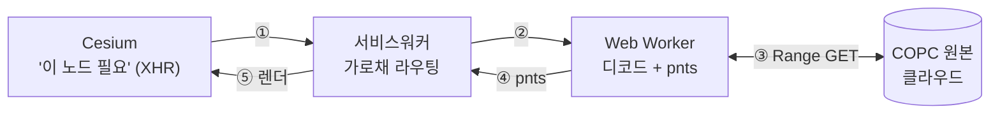
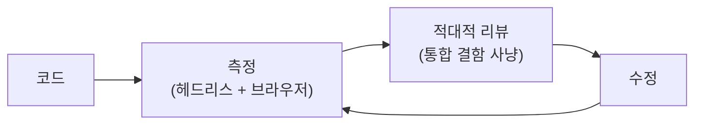

# 06. 실제로 만든 것 — 스트리밍 엔진과 상용 코어로 가는 길

[05장](05-copc-cesium-integration.md)까지가 **"어떻게 만들지"** 계획이었다면, 이 장은 **"무엇을 만들었나"** 입니다. 다리는 실제로 섰고, 그 다음이 더 중요했습니다 — **"돌기만 함"에서 "상용 코어 품질"로** 가는 길.

## 다리는 이렇게 섰다 (A안 실현)

05장의 `???`(COPC → ??? → Cesium)는 이렇게 채워졌습니다:

세 가지가 핵심입니다:

- **Cesium은 COPC를 모른다** → 평범한 3D Tiles 서버인 줄 알고 타일을 URL로 요청합니다.
- **서비스워커가 그 요청을 가로채** 페이지로 넘기고, 무거운 디코드는 **Web Worker**가 메인스레드 밖에서 합니다 → 자세히는 [디코드는 어디서 도는가](../wiki/decode-in-worker.md) 위키.
- **LOD는 Cesium에 위임**(A안) — "언제 어느 노드"를 우리가 손코딩하지 않습니다 ([ADR-001](../adr/001-provider-plugin-architecture-A.md) · [ADR-002](../adr/002-service-worker-tile-interception.md)).

결과물은 한 줄 API입니다: `CopcTileset.fromUrl(url)`.

## "돌기만 함" vs "상용 코어"

다리가 서서 Autzen(소형)이 떠도, 그건 **프로토타입**입니다. 입상하려면 **핵심 코어가 상용 품질**이어야 합니다. 그 차이를 네 기둥으로 메웠습니다:

| 기둥 | "돌기만 함" | "상용 코어" |
|------|------------|-------------|
| **생명주기** | 세션·워커·리스너가 쌓이고 안 풀림(누수) | `destroy()` 시 정리, 마지막이면 워커 종료 |
| **깊이(스케일)** | 루트 페이지만 → 대용량서 디테일이 *조용히* 끊김 | 서브페이지 온디맨드 → GB 옥트리 임의 깊이 |
| **복원력** | 네트워크 실패 = 타일 실패 (재시도 없음) | range 읽기 재시도 + 타임아웃 |
| **속성** | 고도/색 2가지 | classification·intensity·returns 등 + 폴백 |

## 깊이의 벽 — 하이어라키 페이징

가장 무서운 결함은 **작은 데이터에선 안 보였습니다.** COPC의 옥트리 계층은 페이지로 쪼개져 있는데, 옥트리 전체가 우연히 루트 페이지 하나에 들어가는 소형 샘플은 멀쩡히 떠서 "된다"고 착각하게 만듭니다. 그러나 국가 규모 대용량은 깊은 계층이 서브페이지로 분리돼 있어, 줌인하면 **디테일이 에러도 없이 끊겼습니다.** 성능 이전에 **정확성** 벽이었던 것.

해법은 LOD 위임 철학을 그대로 따릅니다 — 페이지 경계 노드를 **외부 tileset을 가리키는 proxy**로 내보내, Cesium의 줌(SSE)이 곧 페이징 트리거가 되게 했습니다. 깊이는 *본 만큼만* 펼쳐집니다. 자세히는 [하이어라키 서브페이지 페이징](../wiki/hierarchy-subpage-paging.md) 위키 · [ADR-003](../adr/003-hierarchy-subpage-paging.md).

!!! quote "이게 '돌기만 함 vs 상용'의 정체"
    측정으로 확인: 소형 샘플은 서브페이지 0개(전부 보임), 대용량은 100여 개 서브페이지가 통째로 안 보이고 있었다. 추측이 아니라 숫자가 갭을 가리켰다.

## 안 깨지게 — 복원력 + "조용한 실패 금지"

상용 = 네트워크가 흔들려도 그레이스풀하게. 모든 range 읽기에 **재시도(지수 백오프) + 타임아웃**을 둬, 일시적 실패는 자동 회복하고 결정적 실패(404 등)는 빠르게 포기합니다.

이 과정에서 **잠복한 "조용한 실패"** 를 잡았습니다 — 쓰던 라이브러리가 응답 상태(`response.ok`)를 안 보고 5xx 에러 바디를 *점 데이터로 둔갑*시키고 있었습니다. 에러를 삼키면 디버깅이 불가능해지고 "돌기만 함"을 진짜 동작으로 위장합니다. 그래서 이 랩의 규칙: **실패는 반드시 표면화**(throw·로그), 무한 대기도 금지.

## 무엇으로 칠하나 — 속성 견고성

점은 고도만이 아니라 **분류(건물·지면·식생)·강도·리턴 번호**로 칠할 수 있습니다(`colorBy`). 차원이 없는 파일이면 조용히 깨지지 않고 고도 색으로 폴백하며 경고를 남깁니다. 색 로직은 한 모듈로 모아, 모드 추가가 한 곳에서 끝나게 했습니다.

## 측정으로 말한다

네 기둥 모두 **추측이 아니라 측정으로** 검증했습니다 — 이게 이 프로젝트의 정체성입니다:

- 페이징: 서브페이지 노드가 로드 전엔 미스 → 로드 후 디코드됨을 결정적으로 확인.
- 복원력: 일시 실패→재시도→성공, 404→즉시 실패, 무응답→타임아웃을 모의로 검증.
- 생명주기: SW가 서빙하는 타일 상태(200/500)로 정리·재생성을 확인.
- 그리고 4단계를 쌓은 뒤 **적대적 코드 리뷰**로 통합 결함(타임아웃 정렬·초기화 실패 누수 등)을 잡아 고쳤습니다.

!!! info "지금 위치와 다음"
    헤드리스로 할 수 있는 코어 hardening은 끝났습니다. 남은 **워커풀·메모리 상한(LRU)** 은 *실 GPU 대용량 측정* 데이터로 필요성을 판정한 뒤 착수합니다 — "측정 후 착수" 원칙. 현재 상태는 [PROGRESS](../PROGRESS.md), 변경 이력은 [CHANGELOG](../CHANGELOG.md).

---

← 이전: [05. 통합과 LOD 스트리밍](05-copc-cesium-integration.md) · 다음: [07. 패키징과 외부 환경 검증](07-packaging-and-verification.md) · 처음: [학습 커리큘럼](index.md) · 깊은 내용: [학습 위키](../wiki/index.md) · 결정: [ADR-001](../adr/001-provider-plugin-architecture-A.md)
