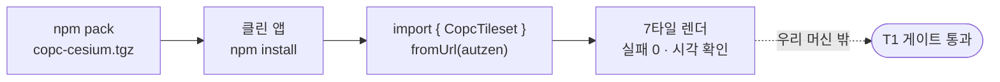

# 07. 남이 쓸 수 있게 — 패키징과 외부 환경 검증

[06장](06-streaming-engine-and-production-core.md)에서 엔진은 상용 코어 품질이 됐습니다. 하지만 **"내 머신에서 됨"은 "남이 새 환경에서 설치해 됨"과 다릅니다.** 이 장은 프로토타입을 `npm install copc-cesium` 한 줄로 쓰는 라이브러리로 만들고, 그게 *우리 머신 밖*에서도 도는지 증명하는 이야기입니다.

!!! quote "T1 게이트 — 판정 한 문장"
    깨끗한 환경에서 `npm install copc-cesium` → `CopcTileset.fromUrl()` → 렌더가 재현된다. 심사물(코드·보고서·영상)이 전부 이 한 줄을 증명해야 한다.

## "소스가 도는 것"과 "패키지가 도는 것"은 다르다

라이브러리는 소스 뭉치가 아닙니다. **소비자의 번들러·워커 컨텍스트·peer 의존성** 위에서 다시 조립돼야 합니다. 그 경계에서 세 난제가 나왔습니다 — 전부 *소형 데모에선 안 보이던* 종류였습니다(06장의 "깊이의 벽"과 같은 함정).

| 난제 | 소스(`npm run dev`)에선 | 패키지(소비자 앱)에선 |
|------|------------------------|----------------------|
| **워커 의존성** | Vite가 bare import 해석 | 소비자 *워커 컨텍스트*에서 `comlink`·`laz-perf`·`copc` eval 실패 → comlink 무응답 → `fromUrl` hang |
| **fetch 변종** | 브라우저 fetch | 번들된 `copc`→`cross-fetch`가 node 변종(`node-fetch`→`punycode require`)으로 해석 |
| **WASM 경로** | `?url` 임포트 | 소비자 빌드에 그 경로가 없음 |

해법은 **출하 워커를 self-contained로 번들**(모든 의존성 포함)하고, **`platform: 'browser'`**로 node 변종을 차단하고, WASM은 빌드 후처리로 상대경로(`new URL('./laz-perf.wasm', import.meta.url)`)로 바꿔 dist에 복사하는 것이었습니다. 자세한 결정은 [CHANGELOG](../CHANGELOG.md)의 패키징 항목에.

## 서비스워커를 소비자 앱에

엔진의 핵심은 **서비스워커가 Cesium의 타일 요청을 가로채는 것**([06장](06-streaming-engine-and-production-core.md))이라, 소비자도 그 워커를 자기 사이트 루트에 두어야 합니다:

```bash
cp node_modules/copc-cesium/dist/copc-sw.js public/copc-sw.js
```

워커의 scope는 **content 경로(`/__copc-real/…`)를 덮어야** 합니다. 못 가로채면 — 이 랩의 규칙대로 — **조용히 실패하지 않고** `fromUrl()`이 명확한 에러를 던집니다. "되는 척"이 가장 비싼 버그라서.

## 재현이 곧 합격

증명은 측정으로 합니다. **별도의 깨끗한 Vite 앱**에 `npm pack` tarball을 설치하고, 소비자 시점으로 한 줄을 돌렸습니다:



SW 가로채기·워커 디코드·WASM 로드·의존성이 **전부 소비자 환경에서** 작동했습니다. 이게 06장의 "측정으로 말한다"가 패키징 단계에서 갖는 모습입니다.

## 적대적 리뷰가 "FAIL"이라 했을 때 — 측정으로 되받기

여기서 가장 중요한 한 장면이 나옵니다. 적대적 코드 리뷰가 판정했습니다: *"fromUrl이 cold 소비자 환경에서 `reg.update()`에 hang → **T1 FAIL**."*

반사적으로 그 줄을 고치고 싶어집니다. 하지만 이 랩의 회로차단기 규칙은 정반대를 말합니다 — **적대적 리뷰어는 항상 무언가를 찾는다. 매 CRITICAL을 "코드 추가"로 반사 대응하지 말 것.** 그래서 고치기 전에 **측정**했습니다:

| 측정 환경 | `reg.update()` | 결과 |
|-----------|----------------|------|
| dev, cold(`installing` 상태) | **1ms resolve** | hang 아님 |
| 프로덕션 빌드, static 서빙, cold | **1ms** (`SW_REGISTERED→SW_UPDATED` 1ms) | fromUrl 완료 |
| 리뷰가 쓴 *그 빌드*의 콘솔 로그 | `SW_UPDATED 1131ms` | 리뷰 자신이 반증 |

그 빌드의 화면을 직접 캡처하니 **포인트클라우드가 RGB·EDL로 완벽히 렌더**되고 있었습니다. "실패"의 근거였던 신호 세 개는 전부 **가짜**였습니다:

- `nonBlackPixels: 0` → WebGL drawingBuffer를 `preserveDrawingBuffer` 없이 읽으면 항상 빈 값. **계측 아티팩트**, 화면은 멀쩡.
- `api.cesium.com 401` → ion 토큰 없는 Viewer **기본 베이스맵** 요청 실패. **라이브러리와 무관**.
- `decode.worker.js 404` → 루트 경로를 직접 찔러본 오탐. 실제 번들은 `/assets/decode.worker-*.js`로 200.

!!! quote "이게 '측정으로 말한다'의 정점"
    적대적 리뷰의 CRITICAL을 코드로 막았다면, *존재하지 않는 버그*에 band-aid를 붙이고 진짜 동작하는 코드를 더 복잡하게 만들었을 것이다. 측정이 리뷰를 반증했다.

## 그래도 남는 진짜 한 줌 — 방어적 개선

false positive 안에도 배울 건 있었습니다. 가짜 원인(`reg.update` hang) 말고 **진짜 약점** 둘:

- `reg.update()`는 **redundant**(register가 이미 update를 트리거)면서 `ensureServiceWorker`에서 **유일하게 timeout이 없는 무한대기 가능 await**였습니다. 느린/단일스레드 서버에선 큰 번들 뒤에 막힐 *수* 있습니다 → **비차단화**(활성/제어 게이트는 register+ready+controller가 담당). 무한 대기 금지([06장](06-streaming-engine-and-production-core.md))와 같은 원칙. **버그 수정이 아니라 방어적 개선**으로 분류.
- ion 401은 *우리* 문제는 아니지만 **smoke 오판의 진짜 원인**이었습니다 → 예제·문서의 Viewer를 `baseLayer: false`로(포인트클라우드는 토큰 불필요). 심사위원이 복붙했을 때 401·검은 지구본에 "깨졌다"고 오해할 false-negative를 차단.

!!! info "지금 위치와 다음"
    T1 게이트는 **통과**입니다 — 패키징·클린앱 재현·CI·README·LICENSE 완료, FAIL 판정은 false positive로 확정. 남은 T1은 산출물 둘뿐: **결과보고서 + 3분 시연 영상**. 우리의 측정·재검증 깊이가 곧 그 보고서의 원재료입니다. 현재 상태는 [PROGRESS](../PROGRESS.md), 변경 이력은 [CHANGELOG](../CHANGELOG.md), 메모리·동시성 위임 근거는 [ADR-004](../adr/004-delegate-memory-concurrency-to-cesium.md).

---

← 이전: [06. 스트리밍 엔진과 상용 코어](06-streaming-engine-and-production-core.md) · 처음: [학습 커리큘럼](index.md) · 깊은 내용: [학습 위키](../wiki/index.md) · 결정: [ADR-004](../adr/004-delegate-memory-concurrency-to-cesium.md)
