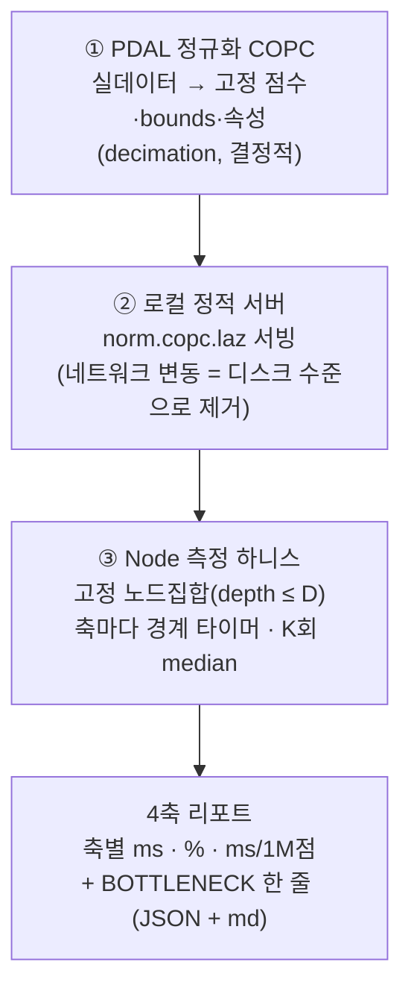
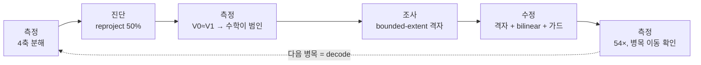

# 08. 병목을 측정으로 사냥하기 — 결정적 프로파일러와 reproject 50% 제거

[07장](07-packaging-and-verification.md)에서 라이브러리는 *남의 환경에서도* 도는 패키지가 됐습니다. 그러면 다음 질문은 자연스럽게 **"느린 건 어디고, 왜 느린가"** 입니다. 이 장은 그 질문에 **추측이 아니라 측정으로** 답하기 위해 만든 도구 — **결정적 4축 프로파일러** — 와, 그 도구가 찾아낸 첫 번째 병목(`reproject`가 내부 계산의 50%)을 **54× 줄여 없앤** 한 사이클의 이야기입니다.

!!! quote "이 장의 한 줄"
    "느린 것 같다"를 "내부 계산의 50%가 좌표 재투영이고, 그건 배열 할당이 아니라 proj4 투영 수학 자체다"로 바꾼 도구를 만들었다. 그리고 그 진단대로 고쳐 병목을 옮겼다.

---

## 1. 왜 또 측정 도구인가 — 기존 측정이 "안 잡히던" 이유

이 랩에는 이미 벤치가 많습니다(`fair-compare`·`probe-matched`·`compare-eptium`·`profile-io`). 인프라는 멀쩡했는데, **진단의 기준선이 흔들렸습니다.**

| 흔들린 이유 | 무슨 일이 벌어졌나 |
|------------|------------------|
| 두 엔진이 **다른 작업**을 함 | 우리(SSE refine + 2M 예산) vs Eptium(고정 점예산, 뷰포트마다 764k→437k). 그리는 점 수가 달라 같은 잣대로 못 잼 |
| GPU 곡선이 **비선형** | 점 1.3배 → GPU 4.6배. 점 수 미세 차가 측정을 폭발시킴 |
| 입력이 **실 S3** | 네트워크 throttle이 비결정적 → 돌릴 때마다 숫자가 다름 |
| **축 경계가 뭉개짐** | 워커의 `decodeMs` 하나가 `fetch + laz 디코드 + reproject`를 **한 덩어리**로 잡고 있었음 |

마지막 줄이 핵심입니다. "디코드가 느리다"는 숫자 안에 **사실은 네트워크와 좌표변환이 섞여** 있었습니다. 무엇을 고쳐야 할지 가리키지 못하는 숫자였던 거죠.

!!! note "언리얼에서 가져온 사고 — `stat unit`"
    게임 최적화의 첫 동작은 `stat unit`으로 **"지금 무엇에 바운드됐나"**(CPU game / render / GPU)를 보는 것입니다. 프레임이 16ms를 넘으면, *추측하지 않고* 어느 막대가 긴지부터 봅니다. 이 프로파일러는 그 사고를 포인트클라우드 스트리밍의 **4축(IO·decode·reproject·build)** 으로 옮긴 것입니다. 진단 프로토콜 전체는 [PROFILING.md](../PROFILING.md)에.

목표는 분명해졌습니다: **우리 내부 계산 파이프라인의 병목을, 네트워크 노이즈를 제거한 채, 축별로 결정적·반복가능하게 분해한다.** (Eptium과의 비교는 이 도구의 목표가 아닙니다 — 그건 별개의 벤치가 합니다.)

---

## 2. 도구의 생김새 — 세 개의 독립 부품

신뢰할 수 있는 측정의 비결은 **변동을 하나씩 죽이는** 것입니다. 그래서 도구를 서로 독립된 세 부품으로 나눴습니다 — 각각 따로 이해하고 따로 테스트할 수 있게.



### ① 정규화 COPC — 입력을 고정한다

무작위 합성 데이터를 쓰면 안 됩니다. **LAZ는 인접한 점을 예측해서 압축**하기 때문에, 공간적으로 뒤죽박죽인 합성 점은 디코드 비용·바이트 수가 *거짓*이 됩니다. 그래서 실데이터(autzen)를 PDAL `filters.decimation`으로 **고정 간격 솎아내기** 해서, 점 수·bounds·속성 집합이 항상 같은 COPC를 만듭니다. 생성 스크립트(`scripts/bench/gen-norm-copc.sh`)는 커밋하고, 산출물(`data/`, 수십 MB)은 gitignore + 재생성 한 줄로 관리합니다.

### ② 로컬 정적 서버 — 네트워크를 죽인다

실 S3 대신 로컬에서 같은 파일을 서빙합니다. IO 변동이 **디스크 수준**으로 떨어져서, 내부 계산 축이 네트워크 노이즈에 가려지지 않습니다. (네트워크 자체의 brittle 문제는 별건 [#14](../issues/14-deep-load-fetch-timeout-brittle.md)가 다룹니다 — 여기선 일부러 통제해서 *지웁니다*.)

### ③ Node 하니스 — 프로덕션 코드를 *건드리지 않고* 경계를 잰다

가장 중요한 설계 원칙: **`src/`는 한 줄도 안 고칩니다.** 하니스가 프로덕션과 *똑같은 프리미티브*를 호출하되, 그 사이에 경계 타이머만 끼웁니다.

| 축 | 무엇을 재나 | 어떻게 격리하나 |
|----|-----------|---------------|
| **IO** | range fetch (헤더 TTFB + 바디) | 로컬이라 작음 — 통제됨 |
| **decode** | laz-perf 압축 해제 + XYZ 추출 | 디코드 총 ms에서 IO ms를 뺌 |
| **reproject** | proj4 수평 좌표변환 | XYZ getter 읽기 + 변환 루프만 |
| **build** | pnts 양자화 + ECEF 고도 변환 + 패킹 | `buildQuantizedPnts` 전체 |

!!! warning "측정 도구가 빠지기 쉬운 함정 — lazy decode 누수"
    laz-perf가 디코드를 **언제** 하느냐가 함정이었습니다. `loadPointDataView`가 호출 즉시 디코드(eager)하는 게 아니라 첫 getter 호출 때 미루면(lazy), **디코드 시간이 reproject 축으로 새어** 들어가 두 축이 오염됩니다. 그래서 reproject를 재기 *전에* 한 차원을 강제로 전부 읽어(materialize) 디코드 비용을 decode 축에 확실히 귀속시켰습니다. 이건 추측이 아니라 검증 기준(AC #4)으로 **인위적 지연 getter**를 넣어 "IO만 부풀려도 decode는 안 변한다"로 실증했습니다.

### 결정성 — 같은 입력은 같은 숫자를 낸다

- **K회 median**(예: 5회) + 워밍업 1회 제외 → JIT·머신 노이즈 흡수
- **점수 정규화 `ms/1M점`** 병기 → 노드집합이나 데이터를 바꿔도 **축 비중을 비교 가능**
- 목표: 같은 입력 5회의 축% 변동 **< 5%p** (실측은 **0%p** — 2회 재현에서 완전히 동일했습니다)

실행은 한 줄입니다:

```bash
bash scripts/bench/gen-norm-copc.sh          # 정규화 COPC 1회 생성 (PDAL 필요)
npm run profile:axes -- data/norm-autzen-2M.copc.laz 5 5   # depth≤5, 5회 median
```

---

## 3. 도구가 가리킨 것 — "디코드가 아니라 좌표변환"

도구를 돌리자 직관과 다른 그림이 나왔습니다. 모두가 "포인트클라우드는 디코드가 느리다"고 믿지만, 측정은 달랐습니다:

| 축 | % | ms/1M점 |
|----|---|---------|
| IO (local) | 3% | 32.5 |
| decode (laz + xyz 추출) | 43% | 504.9 |
| **reproject (proj4 수평)** | **50%** | **582.2** |
| build (ecef + 양자화 + pack) | 5% | 55.8 |

**내부 계산의 절반이 좌표 재투영**이었습니다. 디코드(43%)보다 컸죠. 게다가 정규화 데이터든 raw autzen이든 비중이 똑같이 나와서(IO 3 · decode 42~43 · reproject 50 · build 5), **입력과 무관하게 견고한** 진단이었습니다.

!!! tip "이게 도구의 값어치"
    이 한 표가 없었다면, 우리는 "느린 deep-load"를 고치려고 **디코드를 만지작거렸을** 겁니다 — 잘못된 50%를. 측정이 레버를 정확히 가리켰습니다: 디코드가 아니라 **좌표 재투영**.

---

## 4. 진단 — "왜 느린가"를 한 번 더 측정으로 좁히다

병목 축을 찾았다고 끝이 아닙니다. reproject가 느린 이유가 **무엇이냐**에 따라 처방이 완전히 달라집니다:

- 만약 **JS 배열 할당 오버헤드**라면 → 배열 재사용 같은 미세최적화로 잡힘
- 만약 **proj4 투영 수학 자체**라면 → 미세최적화로는 못 잡고, 점당 계산 횟수를 줄여야 함

그래서 또 추측하지 않고, 격리 마이크로벤치(`scripts/bench/check-reproject.ts`)로 **두 가설을 직접 갈랐습니다** — 실 autzen CRS(Lambert → WGS84)로 합성 2M점을 변환하며:

| 버전 | ms/1M점 | 비고 |
|------|---------|------|
| V0 현재 (새 배열 + forward + push) | 574.4 | 하니스 582와 일치 → **재현 성공** |
| V1 배열 재사용 (할당 제거) | 563.9 | **고작 Δ 2%** |

**V0 ≈ V1.** 할당을 전부 없애도 2%밖에 안 줄었다는 건, 비용이 배열에 있지 않다는 결정적 증거입니다. 범인은 점마다 도는 **Lambert Conformal Conic 역투영 + NAD83→WGS84 데이텀 변환**이라는 **투영 수학 그 자체**(~570ns/점)였습니다.

!!! note "이 한 줄이 처방을 바꾼다"
    "배열 재사용으로는 못 잡는다"가 확정되는 순간, 손쉬운 미세최적화는 후보에서 빠집니다. 진짜 레버는 단 하나 — **점당 proj4 호출 횟수를 줄이는 것**. 측정이 처방을 좁혔습니다.

---

## 5. 해결 — bounded-extent 격자 + bilinear 보간

`context7`로 proj4js의 best practice를 조사한 결론은 명확했습니다.

- **proj4js엔 배치 API가 없다** — 재사용 변환기만 제공하고, 우린 이미 1회 생성해 재사용 중. 점당 비용은 투영 수학 자체(§4에서 확정).
- **그래서 핵심 BP는 "bounded-extent 근사"** — COPC는 **유한한 영역**(autzen은 약 1km×1.4km)을 담습니다. Lambert 같은 conformal 투영은 **작은 영역에선 거의 선형**입니다. 그러니 영역 위에 듬성한 **proj4 control 격자**를 한 번 깔고, 점마다는 **bilinear 보간**으로 위치를 채우면 — 점당 proj4 호출이 **사라집니다.**

```mermaid
flowchart LR
    H["데이터셋 bounds<br/>(copc.header)"] -->|딱 1회| G["(G+1)×(G+1) proj4 격자<br/>예: 9×9 = 81개 control 점"]
    G --> P["점 2백만 개<br/>→ 각자 속한 셀에서<br/>bilinear 보간 (proj4 호출 0)"]
    G -.->|셀당 다점 오차 측정| GD{"max 오차<br/>< 임계?"}
    GD -->|예| P
    GD -->|아니오 (대형/비정상 CRS)| FB["proj4 점별 폴백<br/>(정확성 보존)"]
```

핵심은 **격자를 데이터셋당 딱 한 번**(노드마다가 아니라) 만든다는 것입니다. 81번의 proj4 호출로 2백만 점을 덮습니다. 정확도는 측정으로 조율했습니다:

| 방식 | ms/1M점 | 속도 | max 오차 |
|------|---------|------|---------|
| V0 proj4 점별 (현재) | 565 | 1× | (기준) |
| V2 단일 셀 bilinear (proj4 4개) | 4.6 | 124× | 21mm ❌ |
| **V3 격자 8×8 (proj4 81개)** | **12.3** | **46×** | **0.33mm** ✅ |
| V3 격자 16×16 (proj4 289개) | 8.3 | 68× | 0.08mm ✅ |

격자 해상도 `G`로 오차를 **sub-mm까지 자유롭게** 조절하면서 수십 배 가속합니다. 0.33mm는 lidar 정밀도(cm~dm)와 렌더 픽셀보다 **훨씬 아래**라 시각·정확성에 무해합니다.

!!! warning "정확성을 어떻게 *보증*하나 — 오차 가드 + 폴백"
    "작은 영역에선 선형"은 autzen엔 맞지만 **대륙급 COPC**엔 안 맞습니다. 그래서 격자를 만들 때 **셀당 여러 점(중심 + 모서리 중점)에서 proj4 대비 실제 오차를 측정**하고, 임계(기본 ~1mm)를 넘으면 `G`를 자동으로 올립니다. 그래도 안 되면(비정상 CRS 등) **proj4 점별 변환으로 자동 폴백**합니다. 정확성은 근사로 *타협하지 않고*, 근사가 안전할 때만 켭니다. 자세한 위험표는 [이슈 #17](../issues/17-reproject-proj4-internal-bottleneck.md)에.

---

## 6. 검증 — 병목이 *옮겨갔다*

같은 도구로 수정 전후를 재서, 진단대로 됐는지 확인했습니다:

| 항목 | 수정 전 | 수정 후 | 판정 |
|------|---------|---------|------|
| reproject ms/1M점 (e2e 하니스) | 582 (50%) | **10.7 (2%)** | **54×** |
| internal compute 합 | 2504ms | **1245ms** | **~2×** |
| BOTTLENECK | reproject | **decode (laz 84%)로 이동** | ✅ |
| max 오차 (vs proj4) | 0 | **0.33mm** (<1mm 가드) | ✅ |
| 정확성 verify (center in Oregon) | PASS | PASS (좌표 동일) | ✅ |

reproject가 내부 계산의 **50% → 2%** 로 떨어졌습니다. 그리고 가장 좋은 신호: **병목이 decode로 옮겨갔습니다.**

!!! success "실데이터로 한 번 더 — 정규화도, 합성 점도 결과를 왜곡하지 않았다"
    측정은 정규화(1/5 decimation) autzen으로, 정확도 검증은 *합성* 균일격자 점으로 했습니다 — 둘 다 의심할 수 있죠. 그래서 **원본 raw autzen(10.65M·비정규화)** 으로 다시 쟀습니다. 4축 비중은 norm과 거의 동일(**decode 84% · reproject 2%**) — 병목은 입력과 무관했습니다. 그리고 격자 bilinear를 **실제 점 6백만 개**(합성 아님)로 검증하니, max 오차가 **합성 worst-case와 정확히 일치(0.329mm)** 하고 ≈88× 가속 — 합성 격자가 오차 상한을 *정직하게* 잡고 있었다는 실증입니다. (`scripts/bench/check-reproject-realpts.ts` · [이슈 #19](../issues/19-decode-laz-internal-bottleneck.md))

!!! quote "도구의 진짜 가치는 '다음'을 가리키는 것"
    한 병목을 없애면 좋은 프로파일러는 **곧바로 다음 병목**을 가리킵니다. 이제 표의 1순위는 decode(laz, 84%)입니다. 추측의 사이클이라면 여기서 멈췄겠지만, 측정의 사이클은 *그냥 도구를 다시 돌리면* 다음 목표가 떠 있습니다. 최적화는 "느낌"이 아니라 **이 표를 반복해서 내려가는 일**이 됩니다.

---

## 7. 이 사이클에서 배운 것

이 한 라운드가 이 랩의 작업 방식을 압축해서 보여줍니다:



- **추측 금지, 측정으로 말한다.** "디코드가 느리겠지"라는 통념을 도구가 뒤집었습니다(범인은 reproject).
- **병목을 찾은 뒤 *한 번 더* 측정해 처방을 좁혔습니다.** V0≈V1이 미세최적화를 후보에서 지웠습니다.
- **근사를 쓰되 정확성은 타협하지 않습니다.** 오차 가드 + proj4 폴백으로 sub-mm를 *보증*합니다.
- **도구를 프로덕션과 분리**했기에(`src/` 무수정), 측정이 코드를 오염시키지 않고도 프로덕션과 동일한 프리미티브를 쟀습니다.

!!! info "지금 위치와 다음"
    reproject 병목은 제거됐고(50%→2%, 54×), 내부 계산은 절반이 됐습니다. 도구가 가리키는 다음 후보는 **decode(laz-perf)** 입니다. 전체 진단 프로토콜은 [PROFILING.md](../PROFILING.md), 이 사이클의 상세 기록은 [이슈 #17](../issues/17-reproject-proj4-internal-bottleneck.md), 측정 산출물은 4축 분해 결과([norm](../bench/axis-norm-autzen-2M.md) · [raw](../bench/axis-raw-autzen.md))에 있습니다.

---

← 이전: [07. 패키징과 외부 환경 검증](07-packaging-and-verification.md) · 처음: [학습 커리큘럼](index.md) · 진단법: [PROFILING.md](../PROFILING.md) · 상세: [이슈 #17](../issues/17-reproject-proj4-internal-bottleneck.md)
