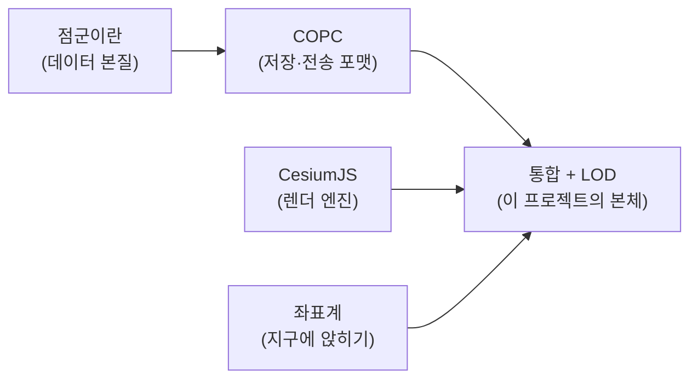

# 학습 커리큘럼 — 이 프로젝트의 기술 스택

> 목적: COPC를 CesiumJS에 띄우는 프로토타입을 만들기 전에, **왜 이 스택이 이렇게 생겼는지**를 먼저 이해한다.
> 3D/렌더링 기본기는 전제로 하고, **새로 익혀야 하는 "지오스페이셜 + 웹" 부분**에 집중한다.

## 큰 그림 한 장

우리가 하려는 일은 한 문장이다:

> **수억 개의 3D 점(COPC)을, 변환 없이, 웹 브라우저의 지구본(Cesium) 위 정확한 위치에, 부드럽게.**

이 한 문장이 4개의 지식 덩어리로 쪼개진다:

## 읽는 순서

| # | 문서 | 한 줄 |
|---|------|-------|
| 01 | [점군 기초](01-point-clouds.md) | 점군이 뭐고 왜 무거운가 |
| 02 | [COPC 포맷](02-copc.md) | 변환 없이 스트리밍되는 점군 파일 |
| 03 | [CesiumJS](03-cesiumjs.md) | 웹 3D 지구본 렌더 엔진 |
| 04 | [좌표계와 georeferencing](04-coordinate-systems.md) | 점을 지구 위 제 위치에 |
| 05 | [통합과 LOD 스트리밍](05-copc-cesium-integration.md) | 둘을 잇는 진짜 문제 |

## 이 문서들과 작업 문서의 관계

- 여기(`learn/`)는 **사람이 읽는 개념 학습용**입니다.
- 실제 작업/측정은 [`../PROFILING.md`](../PROFILING.md)(4축 병목 진단)와 [`../REFERENCES.md`](../REFERENCES.md)(prior art 지도), [`../PROGRESS.md`](../PROGRESS.md)(진행)에 있습니다.
- 05번 문서가 학습과 실제 작업을 잇는 다리입니다.
