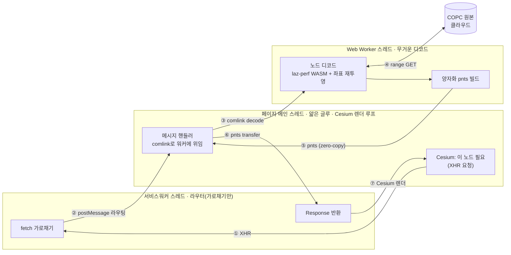

# 디코드는 어디서 도는가

> 서비스워커는 네트워크만 가로채는 라우터, 무거운 디코드(WASM 디코드 + 좌표 재투영 + pnts 빌드)는 **Web Worker**에서 돈다 — 메인스레드(Cesium 렌더 루프) **밖**. 메인스레드는 SW↔워커를 잇는 얇은 글루만 한다.

## 한 줄

Cesium이 노드를 요청하면 [[service-worker-tile-interception]] 가 가로채 페이지로 라우팅하고, 페이지는 **comlink로 Web Worker에 위임**한다. 워커가 그 노드만 디코드해 pnts를 **zero-copy**로 돌려주면 페이지는 그걸 다시 SW로 넘긴다. 가로채기는 SW 스레드, **디코드는 워커 스레드**, 메인스레드는 글루만.

## 흐름 (한 눈에)

핵심: **디코드·pnts 박스가 이제 "Web Worker" 레인 안**에 있다. 메인스레드 레인엔 요청(①)과 위임(글루)만 남았다 — 무거운 WASM 디코드·점별 재투영이 렌더 루프 밖으로 빠졌다.

> **워커가 빌드하는 pnts 는 위치+색만이 아니다.** `attributes` 옵션이 켜지면(기본 큐레이션 4) 워커가 선택된 LAS 속성을 함께 디코드해 pnts 의 **BATCH_TABLE + BATCH_ID** 로 인코딩한다 — Cesium 이 `${Classification}` 등으로 동적 스타일링하고 피킹으로 `getProperty()` 조회할 수 있게(무변환·전체 속성). 결정·제약(`${COLOR}` Model 경로 미작동 등)은 [ADR-005](../adr/005-attribute-fidelity-via-pnts-batch-table.md).

## 왜 워커인가 (의미)

이전 구조에선 세션·laz-perf(WASM) 상태가 **메인스레드 모듈 스코프**에 살아서 디코드도 메인스레드에 묶였고, 그래서 Cesium 렌더 루프와 같은 스레드를 두고 경합했다. 전환의 핵심은 **상태를 통째로 워커로 이주**시킨 것 — 이제 워커가 자기 `sessions`와 WASM 인스턴스를 들고, 디코드 루프·점별 좌표 재투영·pnts 빌드를 전부 메인스레드 밖에서 한다. 결과 pnts만 워커→메인으로 zero-copy 전달되고, 메인은 그걸 다시 SW로 transfer만 한다. "상태가 어디 사는가"가 "디코드가 어디서 도는가"를 정한다 — 그 상태를 옮기니 디코드가 따라 옮겨갔다.

## 비용·주의 (약점)

- **메인스레드 부담 격감**: 이제 메인스레드는 디코드 루프가 아니라 **메시지 왕복 + zero-copy transfer**만. 렌더 프레임 경합이 크게 줄었다.
- **워커는 Cesium을 import하지 않는다**(번들 경량 유지) → pnts 빌드는 Cesium 의존 없는 **양자화 빌더**로 대체됐다.
- **워커 1개 = 내부 직렬, 그러나 풀 확장은 측정상 무효**: 동시에 여러 노드가 들어오면 한 워커 안에서 차례로 처리한다. 손수 라운드로빈 워커 풀을 만들어 A/B(풀 1 vs N, 동일 뷰) 측정해 보니 **동치** — 즉 deep-load 병목은 디코드 스레드가 아니라 **네트워크 IO**(HTTP/1.1 클라우드 호스트당 동시연결 한도 — ADR-004 `maxRequestsPerServer` throttle 영역)다. 풀은 기각·revert. (이슈 #02)
- **laz-perf 빌드 주의**: 기본이 node 빌드라, 워커에선 web 빌드 + wasm URL 주입이 필요(번들러 문맥).

연결: [[service-worker-tile-interception]] · [[copc-octree-lod-streaming]]

## 참고 (RAW 인용)

- 워커 위임 + zero-copy 전달: `src/copc-tileset.ts` (`installHandler`, `getWorkerApi` — comlink wrap)
- 워커 본체(laz-perf web + 디코드 + 양자화 pnts): `src/decode.worker.ts` (`DecodeApi.decode`)
- 디코드 루프(WASM 게터 + proj4 재투영 + 선택 속성 읽기): `src/copc-core.ts` (`decodeNode`)
- 속성 해석(LAS dim → batch-table 타입 스펙): `src/attributes.ts` (`resolveAttributes`)
- 양자화 pnts 빌드(+선택 BATCH_TABLE·BATCH_ID): `src/pnts-quantized.ts` (`buildQuantizedPnts`)
- fetch 가로채기 + MessageChannel 라우팅: `public/copc-sw.js` (`/__copc-real/*`)
- 배경: ADR-002(서비스워커 가로채기) · 커밋 `7591d72`(Phase 2 ③-A 워커 디코드)
